# Docker Swarm dan Microservice

## Install Docker
* Pertama kita buat server di Multipass

    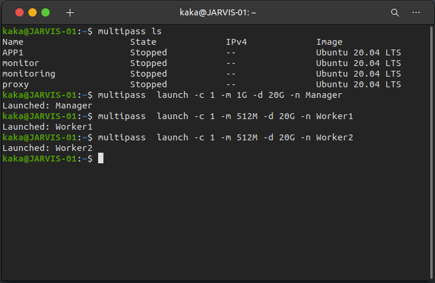

 * Kemudian setelah itu kita install docker menggunakan ansible
 * Setup file hosts dan masukkan ip dari server yang sudah dibuat
 ```
 [swarm]
 10.24.206.20 ansible_user=ubuntu
 10.24.206.156 ansible_user=ubuntu
 10.24.206.111 ansible_user=ubuntu
 ```

 * Kemudian buat file setup-docker.yml
 ```
 - name: Setup Docker & Docker Compose
  hosts: swarm
  become: true
  tasks:
    - name: Setup repository
      shell: "sudo apt-get install ca-certificates curl gnupg lsb-release"
      args:
        executable: /bin/bash

    - name: Add docker GPG key
      apt_key:
        url: https://download.docker.com/linux/ubuntu/gpg
        state: present

    - name: Add docker repository
      apt_repository:
        repo: deb https://download.docker.com/linux/ubuntu focal stable
        state: present

    - name: Update system
      apt:
        update_cache: yes

    - name: Install docker engine
      apt:
        name: "{{item}}"
        state: latest
        update_cache: yes
      loop:
        - docker-ce
        - docker-ce-cli
        - containerd.io

    - name: Install stable release docker compose
      shell: sudo curl -L "https://github.com/docker/compose/releases/download/1.29.2/docker-compose-$(uname -s)-$(uname -m)" -o /usr/local/bin/docker-compose
      args:
        executable: /bin/bash

    - name: Apply executable permission to the binary
      shell: "sudo chmod +x /usr/local/bin/docker-compose"
      args:
        executable: /bin/bash
 ```
 * Kemudian jalankan perintah `sudo ansible-playbook setup-docker.yml`
 * Tunggu hingga proses penginstallan selesai

## Setup Docker Swarm
 * Masuk Keserver yang akan menjadi Manager/leader
 * Jalankan perintah `sudo docker swarm init --advertise-addr (ip dari server manager)
     
     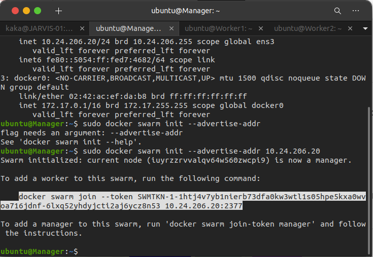

 * Kemudian Copy token dari joker swarm
 * Selanjutnya kita masukkan token yang sudah dicopy ke semua server yg akan menjadi worker
 * Pada tahap ini saya akan melakukannya manual
 * Kita masuk kedalam server yang akan dijadikan worker lalu pastekan token

    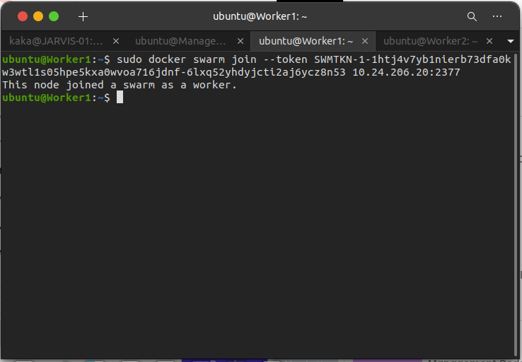

    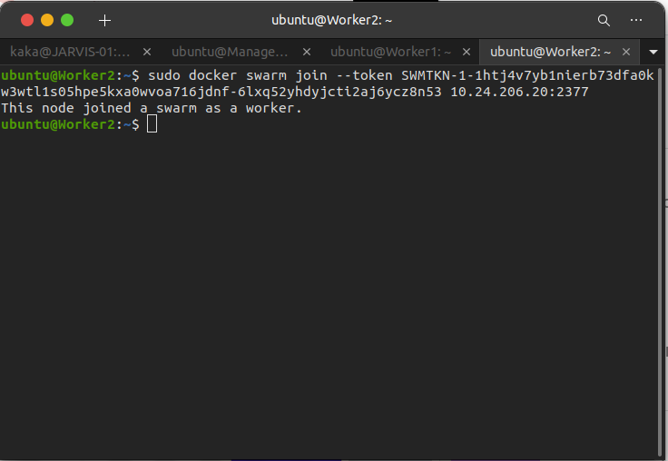

 * Kemudian kita bisa cek dengan `sudo docker node ls`

    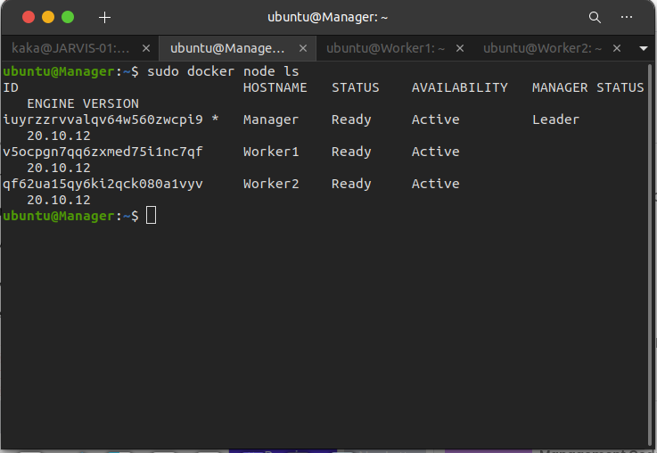

## Push Images kerepository Dockerhub
 * Pertama kita login `sudo docker login`
 * setelah kita login docker kita clone aplikasi Microservice kita `git clone https://github.com/sgnd/dumbways-microservice.git`
 * jika sudah kita buat imagenya dengan docker compose `sudo docker-compose build`
 * Kemudian jika sudah selesai build kita bisa cek images `sudo docker images`

    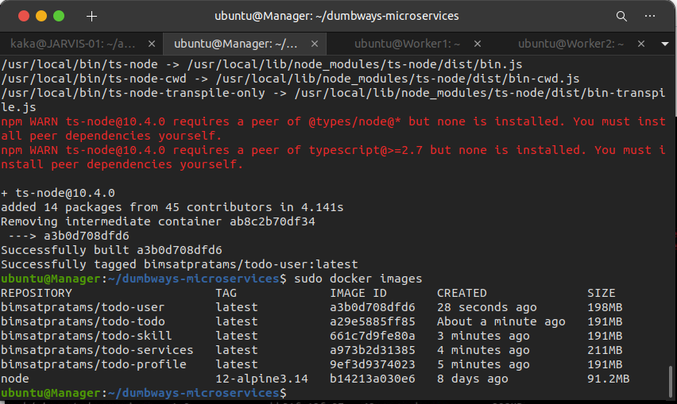

 * Lalu push images ke docker hub

    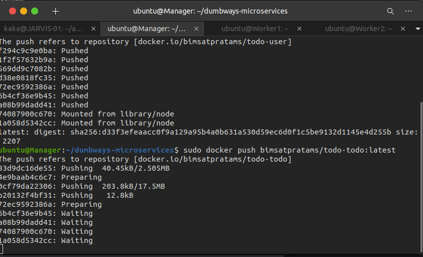

 * Kemudian setelah proses push selesai kita bisa cek di akun dockerhub kita

    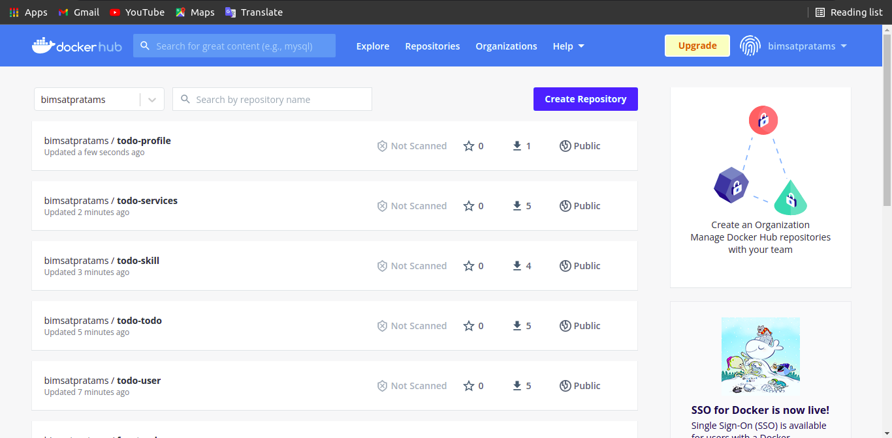

## Stack Deploy App
 * Login keserver manager
 * Masuk kefolder app
 * Jalankan perintah `sudo docker stack deploy --compose-file docker-compose.yml stack-apps`
 
    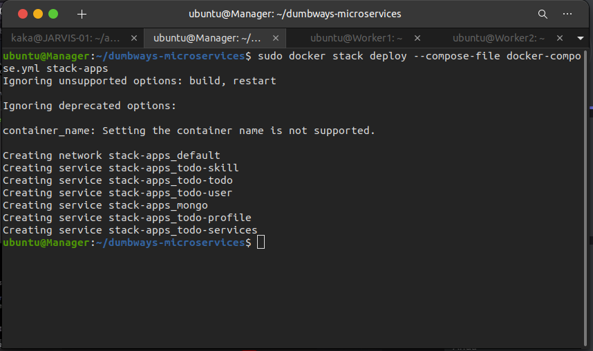

    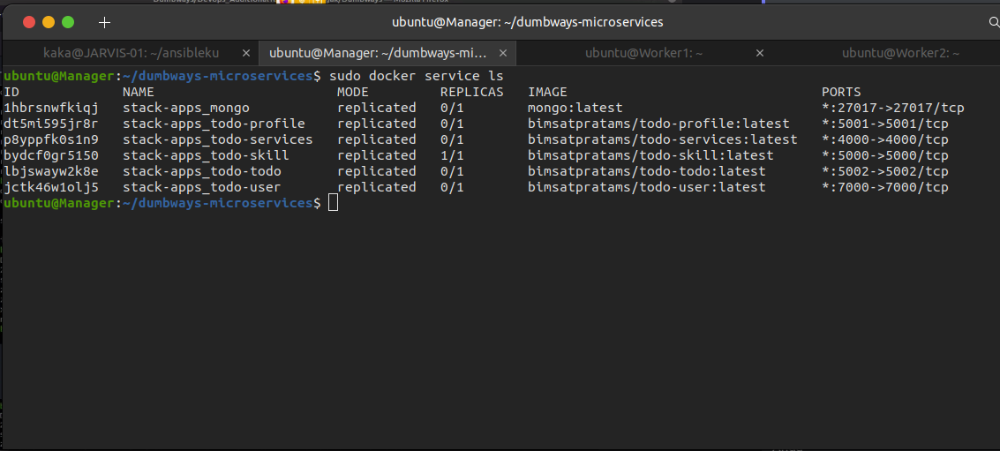

 * Kemudian coba repplicate salah satu container
 * Jalankan perintah `sudo docker service scale ID_Container=jumlah_replica`

    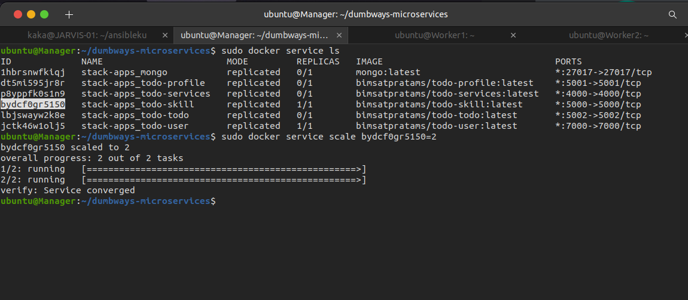

 * Lalu kita bisa cek hasil replica dengan `sudo docker service ps (nama aplikasi yang sudah di scale)`

    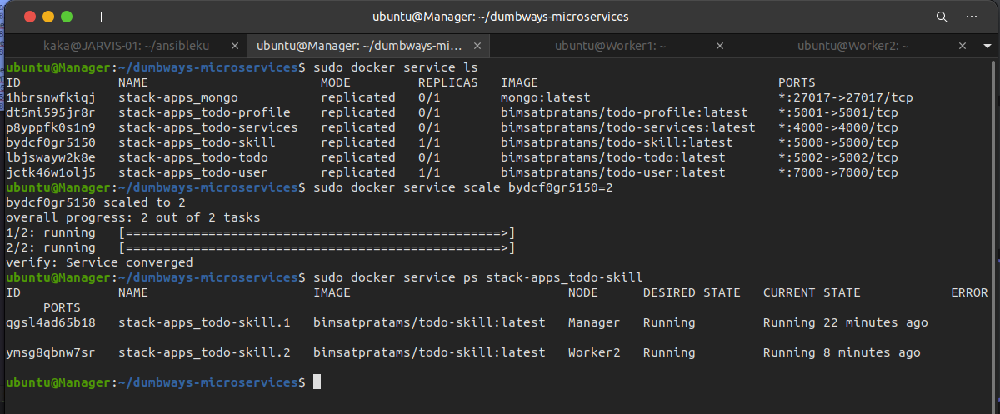

 * Buka browser arahkan ke salah satu ip server worker dan portnya

    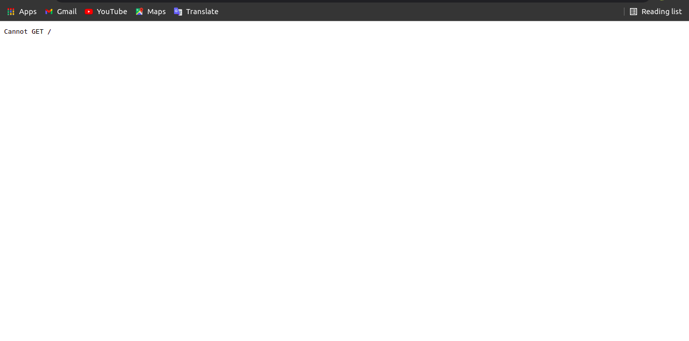