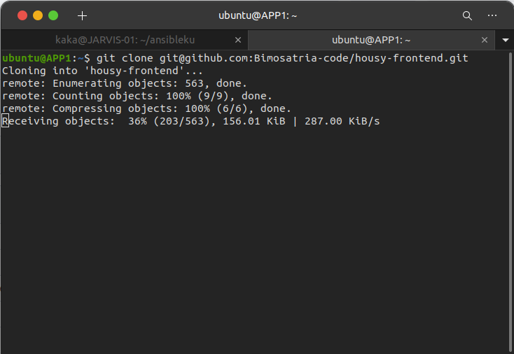
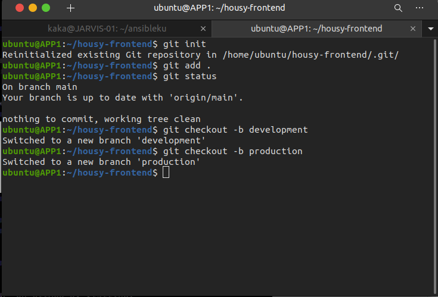
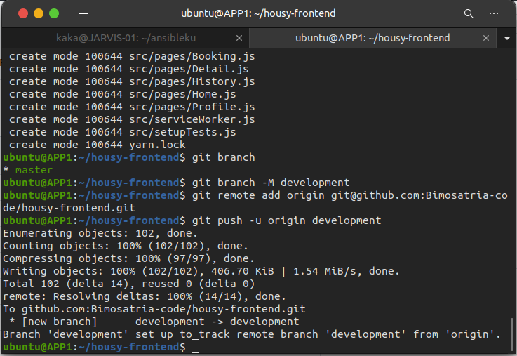
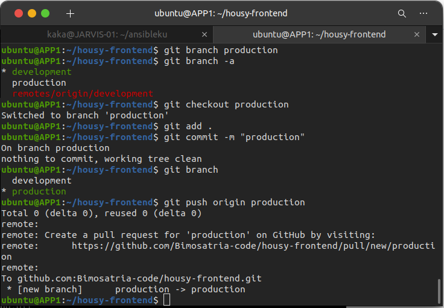
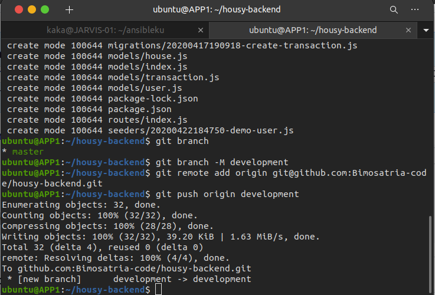
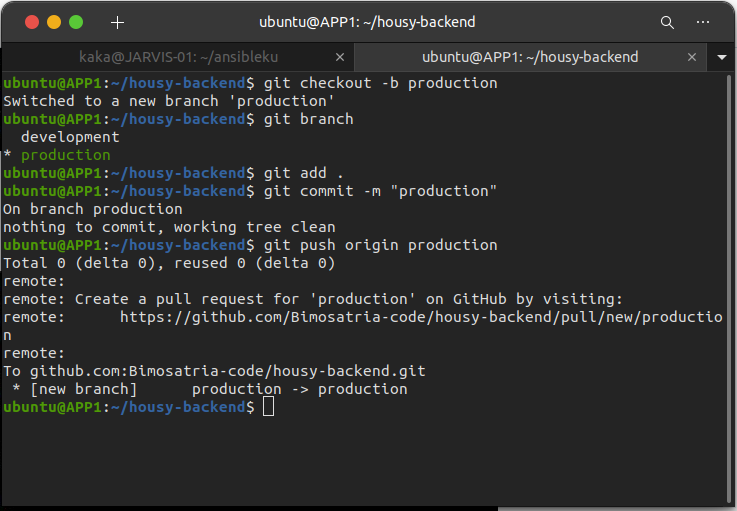

# Repository
## Clone App Housy Frontend Repository
 * Pertama fork aplikasi housy-frontend dr `https://github.com/sgnd/housy-frontend`
 * Kemudian setelah itu clone repository housy-frontend dengan ssh `git clone git@github.com:Bimosatria-code/housy-frontend.git`

   

 * Change direktori kedalam housy-frontend
 * Setelah itu lakukan perintah
   
   `git init`
   `git add .`
   `git commit -m "first commit"`

 * Kemudian setelah tahap commit kita buat branch dan buat remote
   
   `git branch -M development`
   `git remote add origin git@github.com:Bimosatria-code/housy-frontend.git`

   

 * Setelah itu kita push `git push -u origin development`

   

 * Selanjutnya buat branch production dengan menggunakan `git branch production`
 * Lalu pindah kebranch production `git checkout production`
 * Kemudian lalukan
   `git add .`
   `git commit -m "production"`
   `git push origin production`

   

## Clone App Housy Backend Repository
  * Pertama fork aplikasi housy-backend dr `https://github.com/sgnd/housy-backend`
 * Kemudian setelah itu clone repository housy-frontend dengan ssh `git clone git@github.com:Bimosatria-code/housy-backend.git`
 * Change direktori kedalam housy-backend
 * Setelah itu lakukan perintah
   
   `git init`
   `git add .`
   `git commit -m "first commit"`

 * Kemudian setelah tahap commit kita buat branch dan buat remote
   
   `git branch -M development`
   `git remote add origin git@github.com:Bimosatria-code/housy-backend.git`

 * Setelah itu kita push `git push -u origin development`

   

 * Selanjutnya buat branch production dengan menggunakan `git branch production`
 * Lalu pindah kebranch production `git checkout production`
 * Kemudian lalukan
   `git add .`
   `git commit -m "production"`
   `git push origin production`

   

 