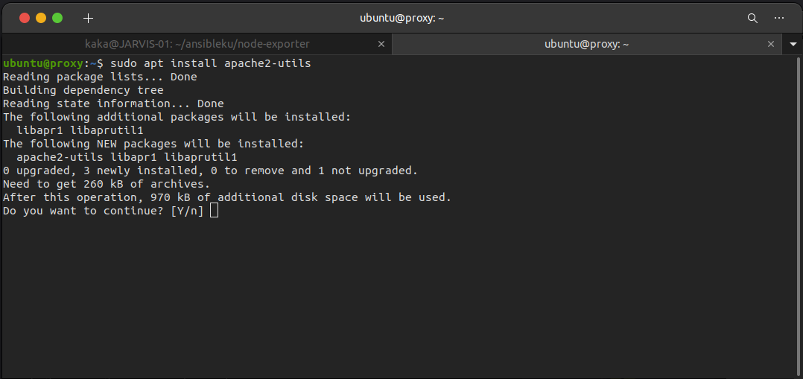
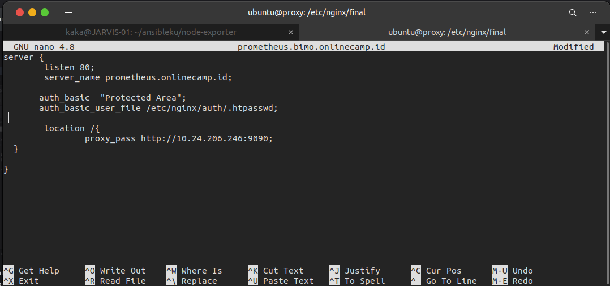
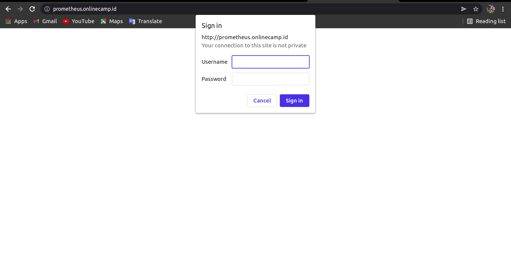

# AUTH
 ## Basic Auth Prometheus
 * Login server nginx
 * Install apache2-utils `sudo apt install apache2-utils`

     

 * Buat direktori auth `sudo mkdir -f /etc/nginx/auth`
 * Buat password file `htpasswd -c /etc/nginx/auth/.htpasswd username
 * Kemudian isikan password
 * Buka reverse proxy prometheus dan edit

     

 * Test config `sudo nginx -t`
 * Buka prometheus di browser

     