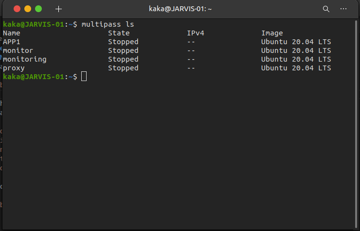
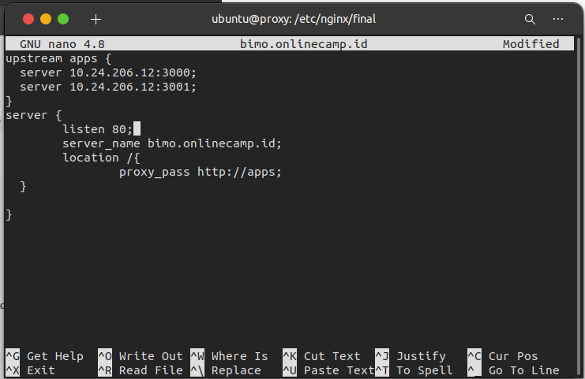
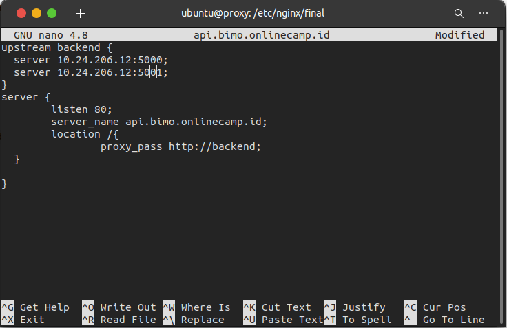

# Server
## Requirements
 * Server Nginx
 * Server Frontend, Backend. Database, CI/CD
 * Server Monitoring

## Create Server Multipass

 * Pertama buat 3 server dimultipass

  `multipass launch -c 1G -m 1G -d 15G -n (name server)`
 
 * Kemudian dapat dicek dengan `multipass list`

    

## Load Balance
 * Disini saya membuat load balance untuk app frontend dan backend
 * Buat config app frontend untuk file `bimo.onlinecamp.id`

    

 * simpan

 * Buat config app backend untuk file `api.bimo.onlinecamp.id`

    

 * simpan

 