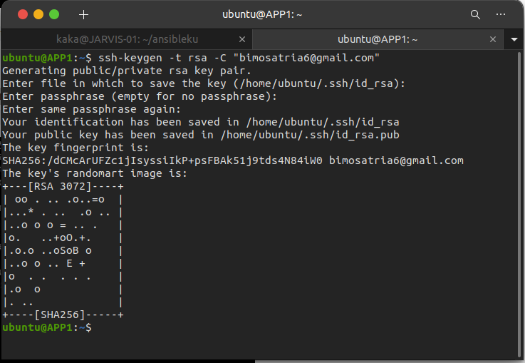
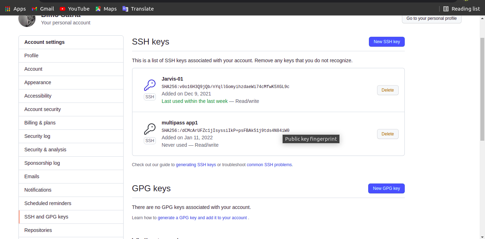
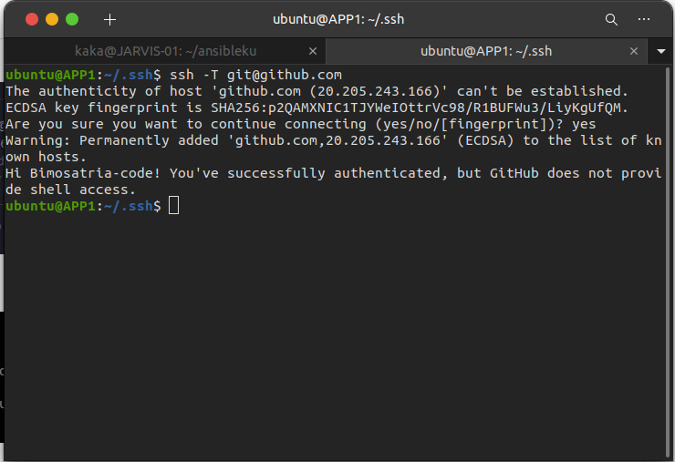

# SSH
## SSH-Key untuk Menghubungkan Dengan Github
 * Untuk membuat ssh key kita gunakan perintah `ssh-keygen -t rsa -C "bimosatria6@gmail.com`
 * nanti kita bisa enter saja jika kita tidak mau menempatkan secara spesifik key yg terbuat nanti pada enter file which to save the key
 * kemudian enter kembali pada passphrase

    

 * Jika sudah terbuat kita bisa cek di folder /.ssh
 * disana akan ada 3 file yaitu authorized_key, id_rsa, id_rsa.pub
 * Selanjutnya kita login ke github kita
 * Pilih menu setting dan cari SSH and GPG keys
 * Kemudian klik new ssh
 * Masukkan title dan kunci id_rsa.pub tadi kemudian add new ssh

   

 * Setelah itu terakhir kita bisa cek keberhasilan koneksi antara server dan github kita

    `ssh -T git@github.com`

 * Jika berhasil akan muncul you have succsessfully authenticated
   
   