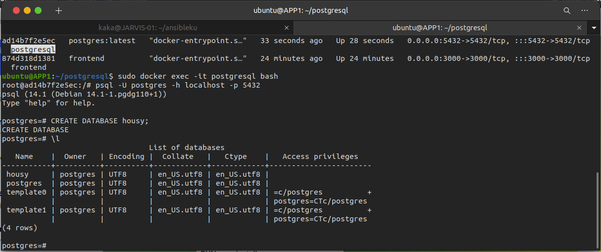

# Database
 * Buat file docker-compose untuk database postgresql
```
version: '3.9'

services:
 postgresql:
  container_name: postgresql
  image: postgres:latest
  ports:
   - 5432:5432
  volumes :
   - /home/ubuntu/postgres-data:/var/lib/postgresql/data
  environment:
   - POSTGRES_PASSWORD=postgres
   ```
 * Save dan jalankan perintah `sudo docker-compose up -d`
 * Setelah itu kita bisa cek dengan menggunakan `sudo docker ps`
 * Jika containernya berjalan kita bisa cek databasenya dengan masuk ke dalam containernya

   `sudo docker exec -it postgresql bash`

 * setelah masuk jalankan perintah `psql -U postgres -h localhost -p 5432`
 * Kemudian buat database `CREATE DATABASE housy`
 
  


 
