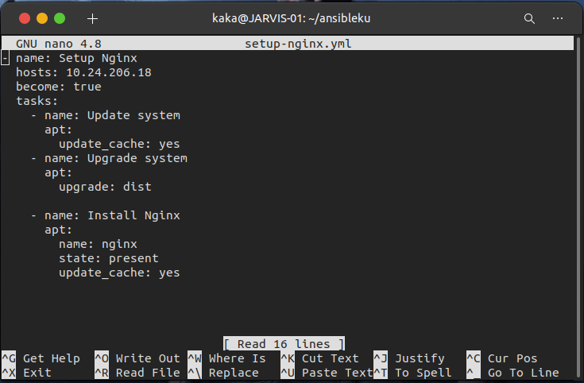

# Webserver
## Setup Nginx Reverse Proxy
 * Pertama masuk keserver reverse proxy dan install nginx dengan menggunakan ansible

    

 * Setelah terinstall kita buat folder final
 * Kemudian kita buat file

   `bimo.onlinecamp.id`
   `api.bimo.onlinecamp.id`
   `jenkins.bimo.onlinecamp.id`
   `prometheus.bimo.onlinecamp.id`
   `monitoring.onlinecamp.id`

 * Buat config app frontend untuk file `bimo.onlinecamp.id`

    

 * simpan

 * Buat config app backend untuk file `api.bimo.onlinecamp.id`

    

 * simpan

 * Buat config jenkins untuk file `jenkins.bimo.onlinecamp.id`

    

 * simpan

 * Buat config prometheus untuk file `prometheus.bimo.onlinecamp.id`

    

 * simpan

 * Buat config monitoring untuk file `monitoring.bimo.onlinecamp.id`

    

 * simpan

 * Kemudian include folder final kedalam nginx.conf
 
    

 * Terakhir test apakah konfig sucsess dengan `sudo nginx -t`