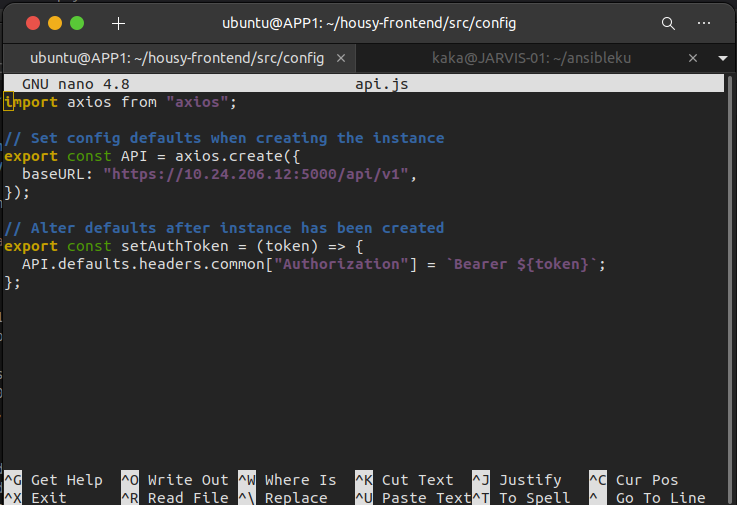
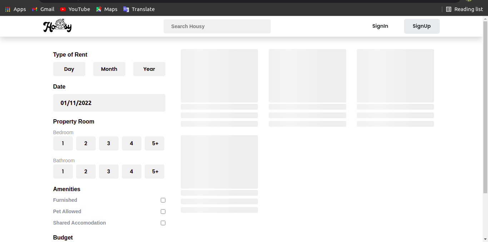
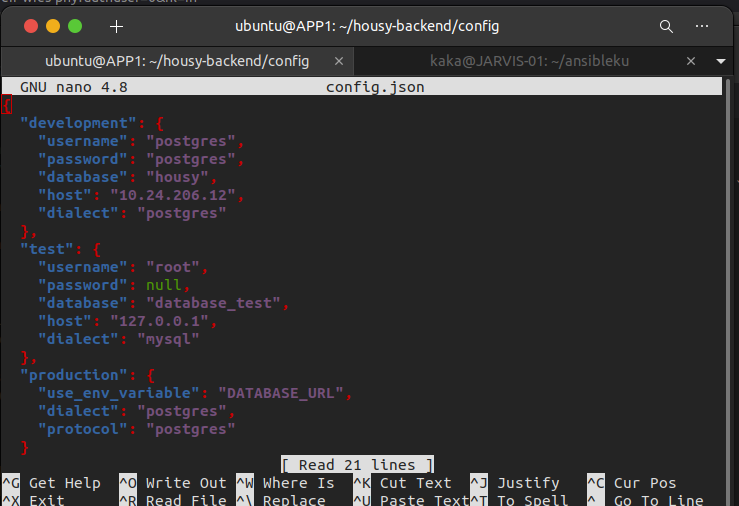
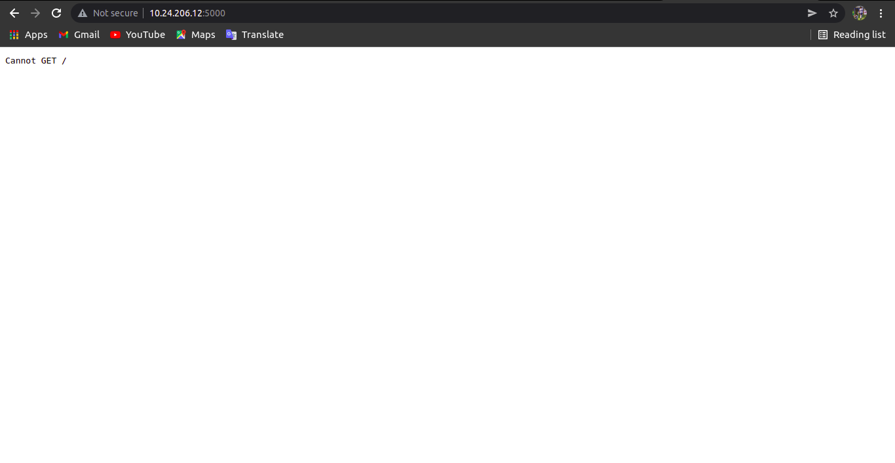

# Deployment
# App Housy-Frontend
 * Pertama Clone apps dari repository `git clone git@github.com:Bimosatria-code/housy-frontend.git`
 * Kemudian setelah itu masuk kedalam folder aplikasi dan ubah pada bagian `src/config/api.js`

    

 * Setelah itu buat Dockerfile didalam folder app-frontend
```
FROM node:10
WORKDIR /app
COPY . .
RUN npm install
EXPOSE 3000
CMD ["npm", "start"]
```

 * Jika sudah maka kita build menjadi docker images dengan perintah `sudo docker build -t frontend .`
 * Jika sudah kita bisa cek images dengan perintah `sudo docker images`
 * Kemudian kita buat container dari app housy-frontend `sudo docker run -itd -p 3000:3000 frontend frontend`
 * Jika sudah kita bisa liat container sudah terbuat dengan perintah `sudo docker ps`, jika ada maka sudah berhasil terbuat dan berjalan
 * Bisa kita cek dibrowser

     

# App Housy-Backend
 * Pertama Clone apps dari repository `git clone git@github.com:Bimosatria-code/housy-backend.git`
 * Kemudian setelah itu masuk kedalam folder aplikasi dan ubah pada bagian `config/config.json`

    

 * Setelah itu buat Dockerfile didalam folder app-backend
```
FROM node:10
WORKDIR /app
COPY . .
RUN npm install
RUN npm install --save sequelize
RUN npm install --save-dev sequelize-cli
RUN npx sequelize-cli db:migrate
EXPOSE 5000
CMD ["npm", "start"]
```

 * Jika sudah maka kita build menjadi docker images dengan perintah `sudo docker build -t backend .`
 * Jika sudah kita bisa cek images dengan perintah `sudo docker images`
 * Kemudian kita buat container dari app housy-frontend `sudo docker run -itd -p 5000:5000 backend backend`
 * Jika sudah kita bisa liat container sudah terbuat dengan perintah `sudo docker ps`, jika ada maka sudah berhasil terbuat dan berjalan
 
     