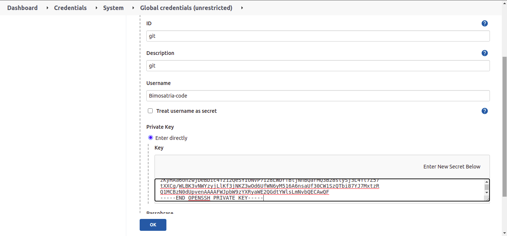
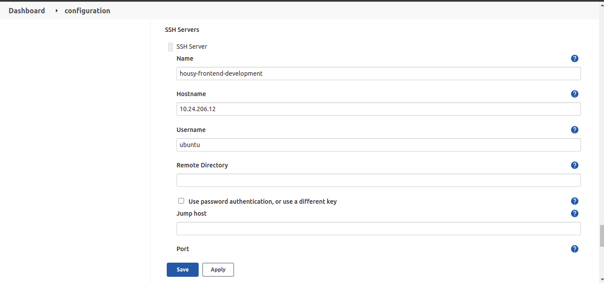
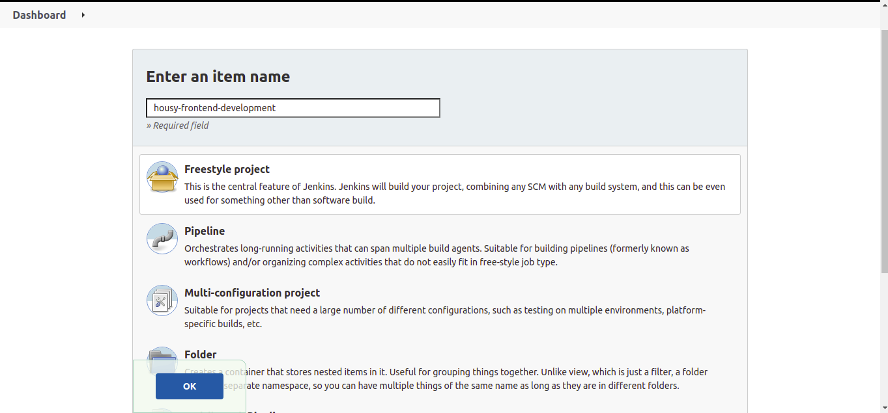
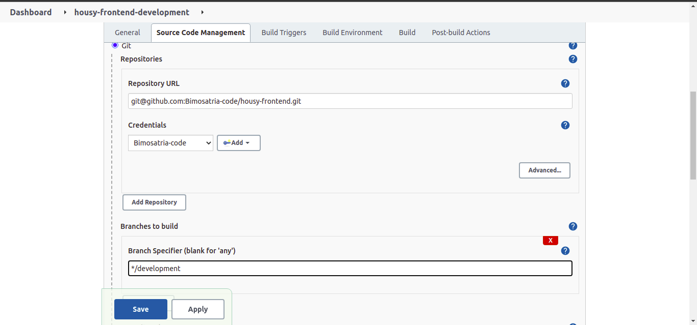
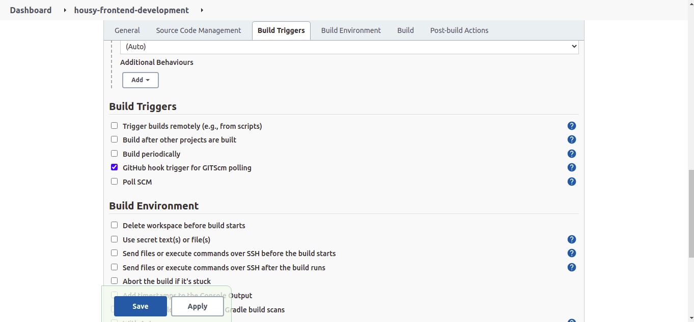
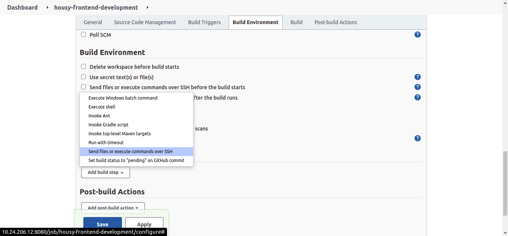
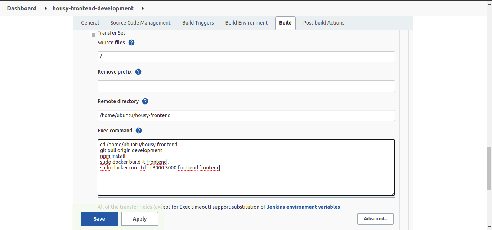
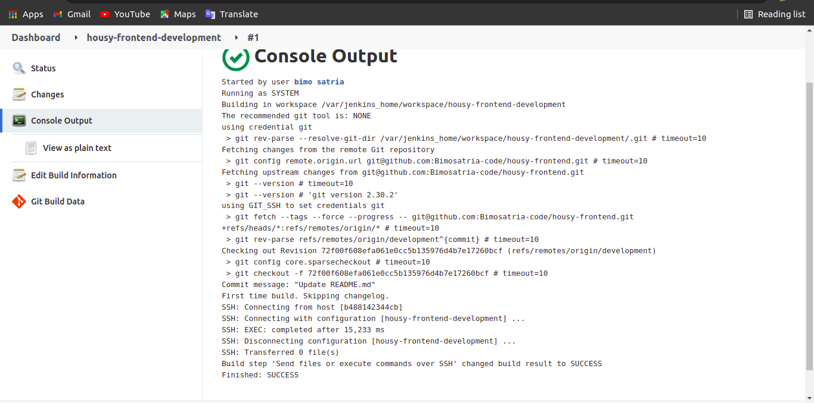
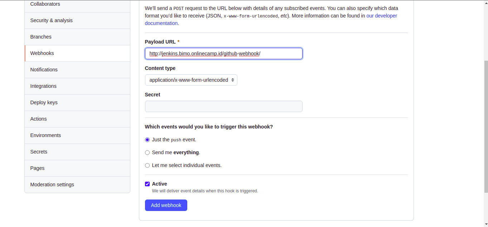

# CI/CD Jenkins
## Install Jenkins
 * Install Jenkins dengan Ansible
 * Pertama kita harus memiliki docker compose dari jenkins

   ```
version: "3.9"

services:
  jenkins:
    image: jenkins/jenkins:lts-jdk8
    container_name: jenkins-server
    privileged: true
    hostname: jenkinsserver
    user: root
    labels:
      com.example.description: "Jenkins-Server by DigitalAvenue.dev"
    ports:
      - "8080:8080"
      - "50000:50000"
    networks:
      jenkins-net:
        aliases:
          - jenkins-net
    volumes:
     - /home/ubuntu/jenkins-data:/var/jenkins_home
     - /var/run/docker.sock:/var/run/docker.sock
     
volumes:
  jenkins-data:

networks:
  jenkins-net:
   

 * Kemudian kita buat file setup ansible untuk jenkins
   ```
- name: Setup CI/CD Jenkins Docker
  hosts: all
  become: true
  tasks:
    - name: Copy docker compose
      copy:
        src: docker-jenkins/docker-compose.yml 
        dest: /home/ubuntu/

    - name: Run docker compose
      shell: "docker-compose up -d"
      args:
        executable: /bin/bash
   

 * Setelah itu jalankan `sudo ansible-playbook setup-jenkins.yml`
 * Jika sudah selesai terinstall kita bisa cek containernya sudah berjalan atau belum dengan `sudo docker ps`
 
 ## Setup Jenkins
  * Pertama kita add credential
  * kita pilih menggunakan ssh dan private key
  * Isi Id, Deskripsi, username dan masukkan keynya
 
    

 * Setelah buat credential setup over ssh agar terkoneksi dengan menggunakan ssh
 * Berikut setup untuk Publish over ssh

    

 ## Setup Job
 * Pilih Create Job
 * Isi nama job
 * Kemudian pilih freestyle dan klik oke

    

 * Setelah itu set Source code management
 * pilih git
 * Isikan url repository aplikasi kita
 * masukkan credentials yg sudah kita buat
 * pilih branch sesuai dengan branch kita

    

 * Pada Build triggers pilih Github hook trigger for GITscm polling

    

 * Kemuidan klik add build step pada Build Environment

    

 * Kemudian pada step build masukkan / pada source files
 * setelah itu masukkan lokasi direktori aplikasi yg sudah kita clone pada remote direktori
 * setelah itu masukkan perintah2 didalam exec command

    

 * lalu klik apply dan save

   

 ## Setup Github webhook
 * Login akun Github
 * Masuk kereposoitory aplikasi
 * Pilih setting
 * masuk ke webhook
 * Masukkan http://jenkins.bimo.onlinecamp.id/github-webhook/

    

 * Simpan 