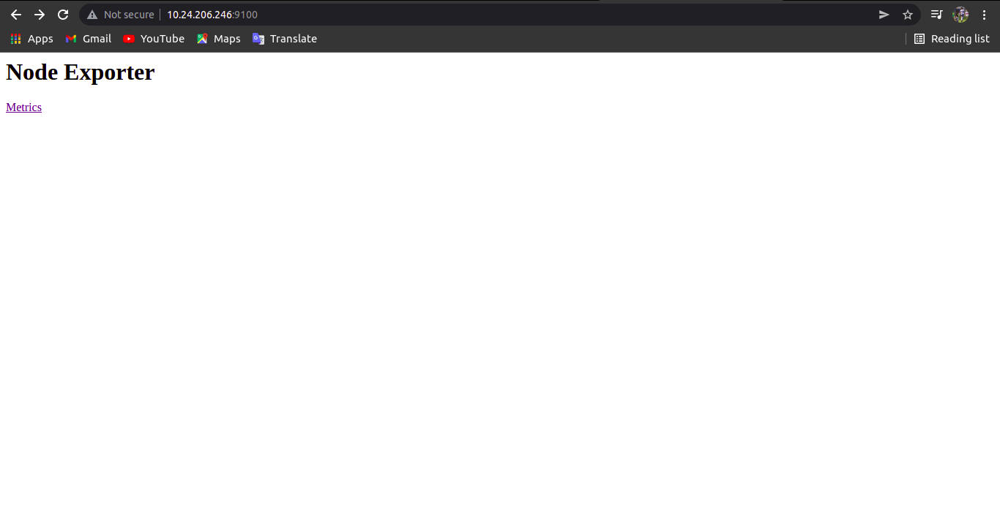
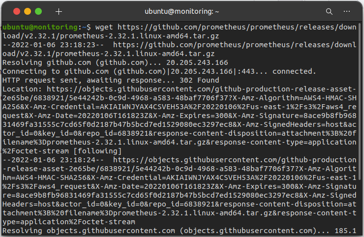
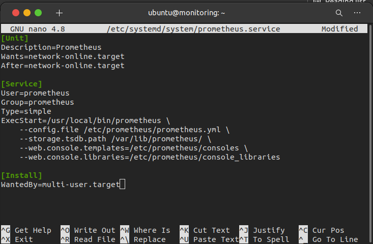
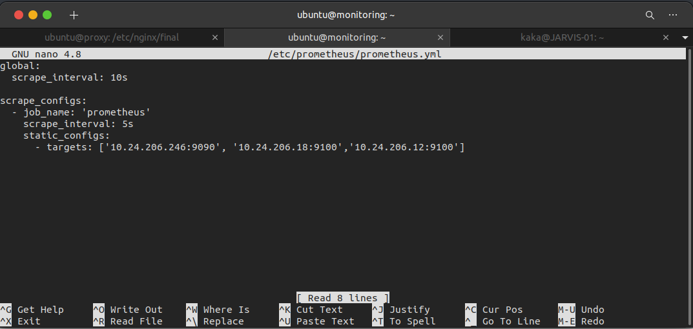
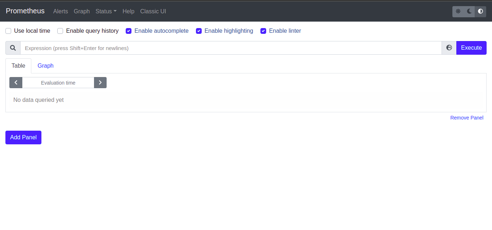
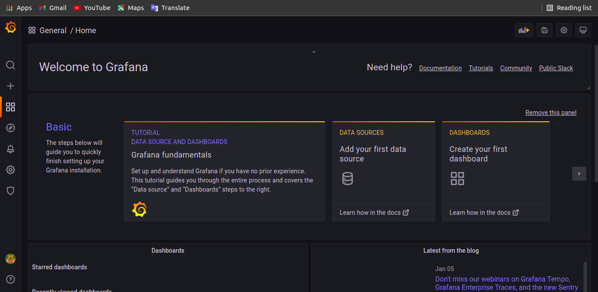

# Monitoring
## Aplikasi yang akan diinstall
 * Node Exporter
 * Prometheus
 * Grafana

 ## Installasi Node Exporter
 * Install Node Exporter dengan docker-compose, berikut isi docker-composenya
```
version: '3'
services:
  node_exporter:
    image: prom/node-exporter:latest
    container_name: node_exporter
    ports:
      - 9100:9100
    command:
      - '--path.procfs=/host/proc'
      - '--path.rootfs=/rootfs'
      - '--path.sysfs=/host/sys'
      - '--collector.filesystem.mount-points-exclude=^/(sys|proc|dev|host|etc)($$|/)'
    restart: unless-stopped
    volumes:
      - /proc:/host/proc:ro
      - /sys:/host/sys:ro
      - /:/rootfs:ro
```

 * Kemudian kita install dengan menggunakan ansible, berikut setup ansible untuk menjalankan installasi node exporter
```
- name: Installing node exporter
  hosts: 10.24.206.12
  become: true
  tasks:
    - name: Copying docker compose file
      copy:
        src: node-exporter/node_exporter-compose.yml
        dest: /home/ubuntu/

    - name: Run docker compose
      shell:
        cmd: "docker-compose -f node_exporter-compose.yml up -d"
```
 * Kemudian jalankan perintah `sudo ansible-playbook setup_node_exporter.yml`
 * Buka browser dan akses http://<alamatIP>:9100

  

## Install Prometheus

 * Download prometheus dengan menggunakan perintah wget

  `wget https://github.com/prometheus/prometheus/releases/download/v2.32.1/prometheus-2.32.1.linux-amd64.tar.gz`

   

 * kemudian ekstrak prometheusnya yang sudah didownload 

  `tar xvf prometheus-2.32.1.linux-amd64.tar.gz`

 * buat file di etc/

  `sudo mkdir /etc/prometheus`

  `sudo mkdir /var/lib/prometheus`

 * copy file-file ke dalam folder etc/prometheus

  `sudo cp prometheus-2.32.1.linux-amd64/prometheus /usr/local/bin/`

  `sudo cp prometheus-2.32.1.linux-amd64/promtool /usr/local/bin/`

  `sudo cp -r prometheus-2.32.1.linux-amd64/consoles /etc/prometheus`

  `sudo cp -r prometheus-2.32.1.linux-amd64/console_libraries /etc/prometheus`

  * Buat konfigurasi prometheus

  `sudo nano /etc/systemd/system/prometheus.service`

   

  * prometheus.yml

  `sudo nano /etc/prometheus/prometheus.yml`

   

  * Buat user Prometheus

  `sudo useradd -rs /bin/false prometheus`

  * ubah semua konfigurasi agar bisa diakses oleh prometheus

  `sudo chown prometheus:prometheus /etc/prometheus`

  `sudo chown prometheus:prometheus /var/lib/prometheus`

  * Buka web browser dan akses `http://(alamat ip):9090`

  `

## Install Grafana

  * `sudo apt-get install -y apt-transport-https`
  * `sudo apt-get install -y software-properties-common wget`
  * `wget -q -O - https://packages.grafana.com/gpg.key | sudo apt-key add -`
  * `echo "deb https://packages.grafana.com/enterprise/deb stable main" | sudo tee -a /etc/apt/sources.list.d/grafana.list`
  * `sudo apt-get update`
  * `sudo apt-get install grafana-enterprise`
  * `sudo systemctl daemon-reload`
  * `sudo systemctl start grafana-server`
  * `sudo sudo systemctl enable grafana-server.service`
  * `sudo systemctl enable grafana-server.service`

  * Setelah proses instalasi selesai, untuk mengamankan grafana agar tidak setiap orang bisa masuk dapat menggunakan perintah

  `sudo nano /etc/grafana/grafana.ini`

  * kemudian ubah pada blok [user] dan blok [auth_anonymous]

  ```
  [users]
  # disable user signup / registration
  allow_sign_up = false
  [auth.anonymous]
  # disable anonymous access
  enabled = false
  ```
  * jika sudah restart grafana sudo systemctl restart grafana-server
  * akses di web browser, <alamatIP>:3000 akan muncul tampilan pertamakali grafana dan masukkan admin/pass:admin untuk masuk pertama kali

  