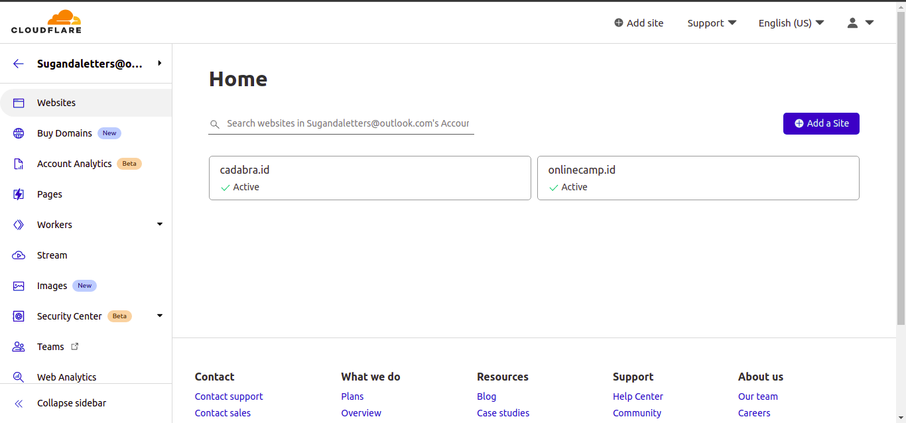
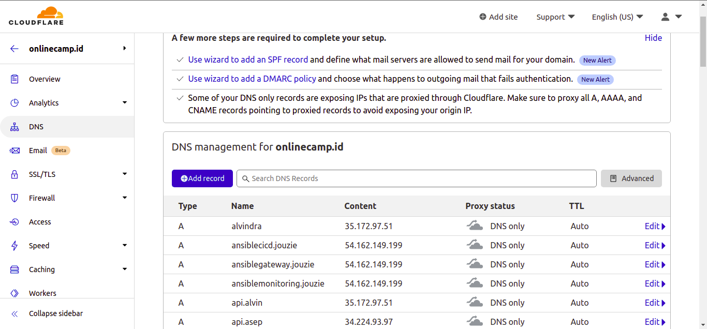
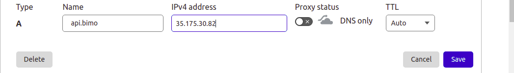
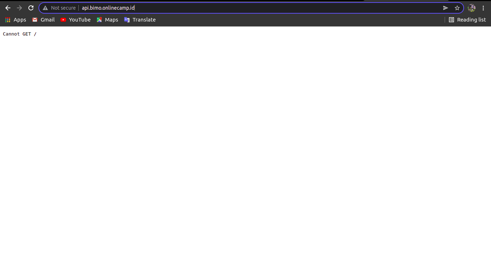

# Custom Domain App Backend
    Pada Pembahasan ini kita akan membahas langkah- langkah Membuat domain dengan DNS di cloudflare untuk app backend, berikut langkah-langkahnya:

 * pertama tama nanti kita akan diinvite oleh mentor dan akan diarahkan membuat password
 * Kemudian login kedalam
 * Setelah itu pada tampilan Accounts kita pilih account email mentor kita
 * Kemudian Didalam tampilan Home kita bisa memilih onlinecamp.id

    

 * Setelah masuk kita bisa memilih pilihan DNS

    

 * Lalu Klik `Add Record` untuk membuat domain
 * Jika sudah kita pilih set type A lalu masukkan nama kita lalu ip address aws server yg sudah diset sebagai gateway
 * Kemudian matikan proxy status dan tekan save

     

 * Jika sudah kita bisa akses domain kita dibrowser

     