# Deploy App Backend
    Pada Pembahasan ini kita akan membahas langkah-langkah menginstall aplikasi Backend kedalam server backend, berikut langkah-langkahnya:

 * pertama tama masuk kedalam server backend
 * Kemudian update dan upgrade terlebih dahulu `sudo apt update` `sudo apt upgrade`
 * Setelah itu kita clone app frontend kita `git clone https://github.com/sgnd/dumbflix-backend.git`

     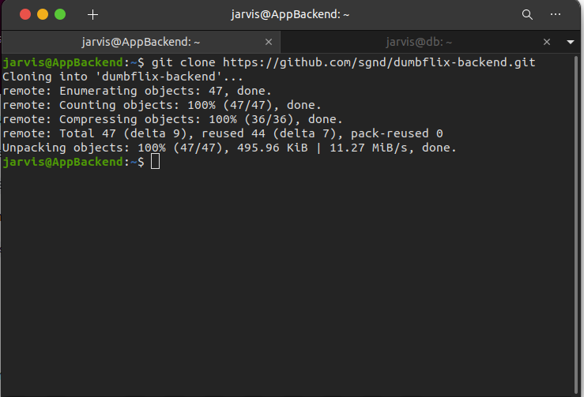

 * Setelah aplikasi terclone kita masuk kedalam direktori aplikasinya `cd dumbflix-backend`
 * Kemudian install node js `curl -o- https://raw.githubusercontent.com/nvm-sh/nvm/v0.39.0/install.sh | bash`

     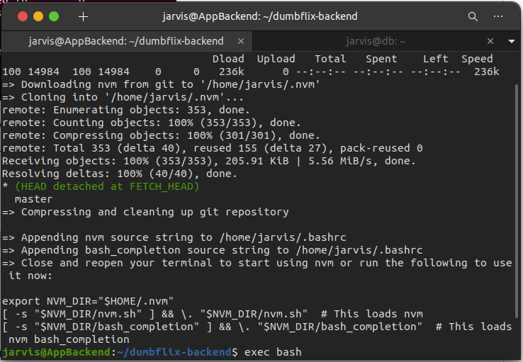

 * Kemudian `exec bash` agar bisa mendeteksi nvm dan npm
 * Lalu `nvm install 14`
 * Lalu `nvm use 14`

     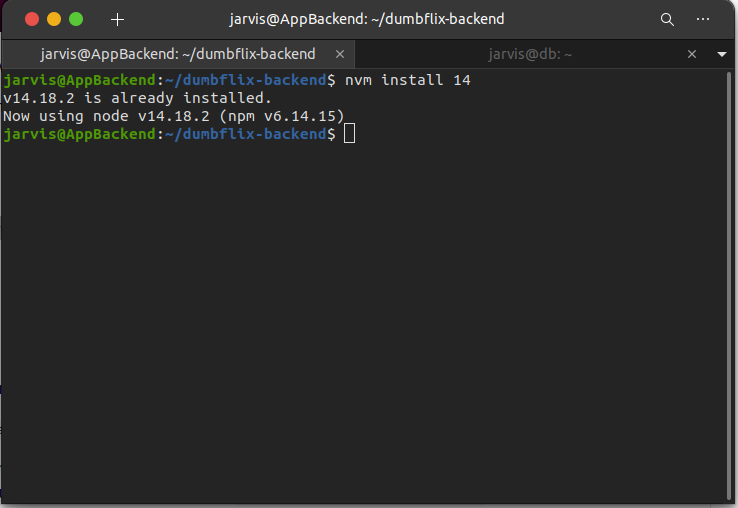

 * Setelah itu kita cek versinya `node -v` `npm -v`
 * Jika sudah kita `npm install`

     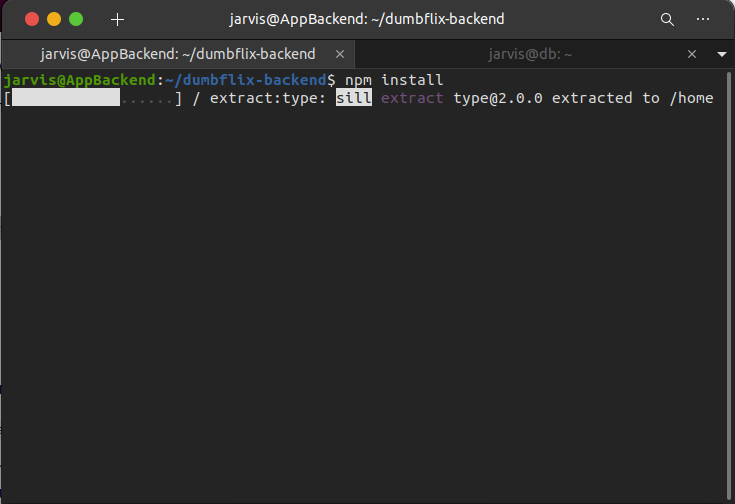

 * kemudian kita install sequelize agar kita bisa migrasi ke database dari appbackend
 * `npm install --save-dev -g sequelize-cli`

     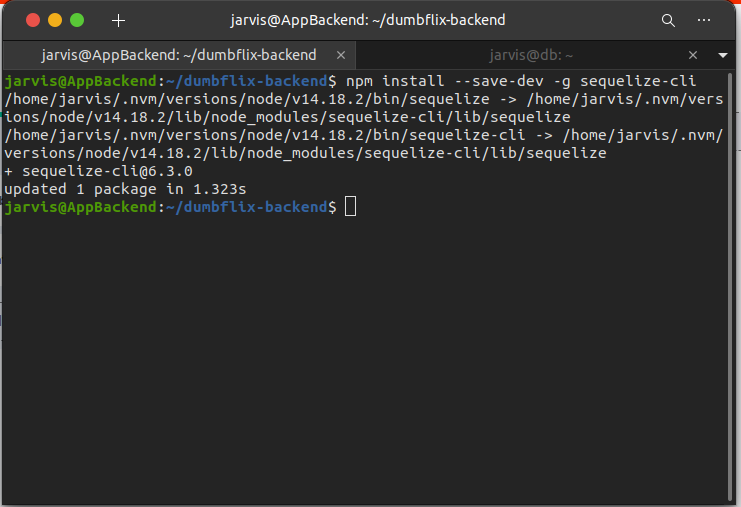

 * Kemudian kita bisa copy file .env `cp .env.example .env` lalu untuk melihat isinya `cat .env`

     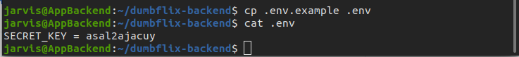

 * Jika sudah kita akan menjalankan aplikasi dengan pm2
 * Mula-mula kita install dulu pm2nya `npm install pm2 -g`

     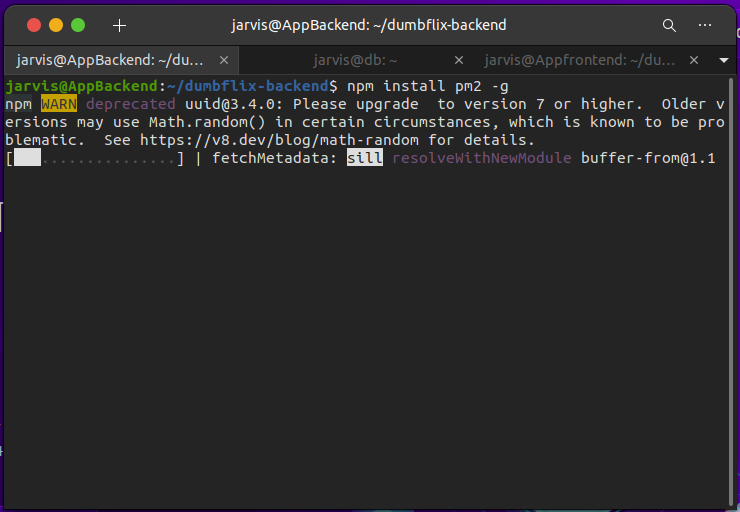

 * Setelah pm2 sudah terinstall buat ecosystemnya jalankan perintah `pm2 ecosystem simple`

     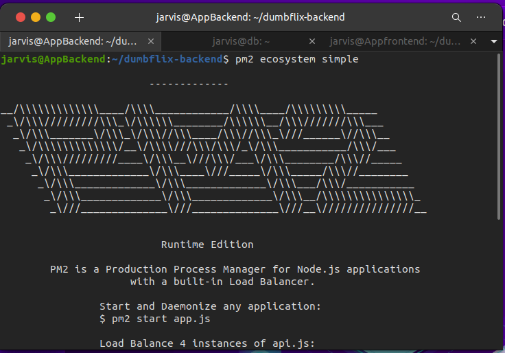

 * Kemudian langkah berikutnya edit file ecosystem.config.js dibagian nama dan scriptnya`sudo nano ecosystem.config.js`

     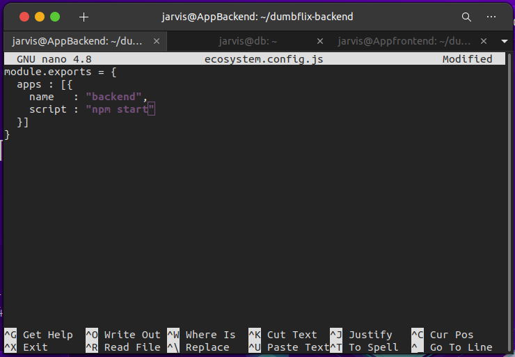

 * lalu jika sudah diedit klik `ctrl + x` lalu `y` dan `enter`
 * Sekarang kita jalankan aplikasi dengan perintah `pm2 start ecosystem.config.js`

     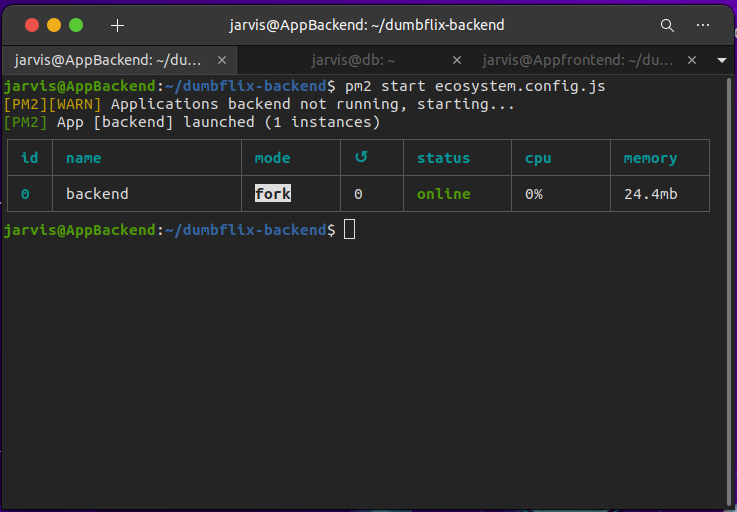

 * Terakhir kita bisa akses dibrowser dengan ip serverapp kita dan portnya `44.198.253.15:5000` 

     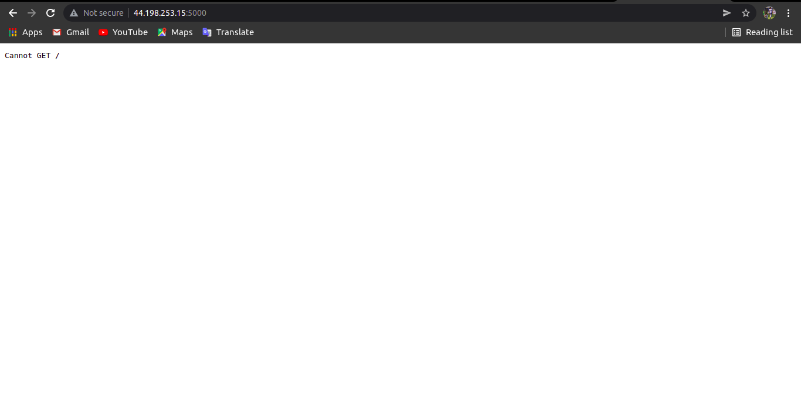

# Set agar App Frontend terhubung dengan App Backend

 * Pertama masuk server App Frontend
 * Kemudian masuk kedalam folder config `cd ~/dumbflix-frontend/src/config`
 * lalu edit api.js `sudo nano api.js`
 * Edit pada bagian baseURL, ganti dengan domain kita `api.bimo.onlinecamp.id`  

     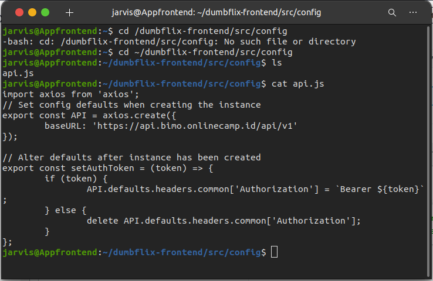

 * Kita bisa coba register dengan akses aplikasi kita, jika sudah berhasil akan bisa tampil data diri kita

     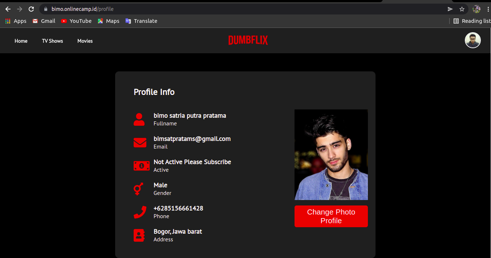