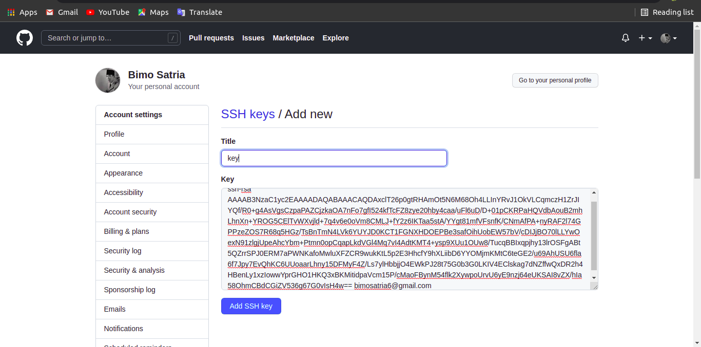
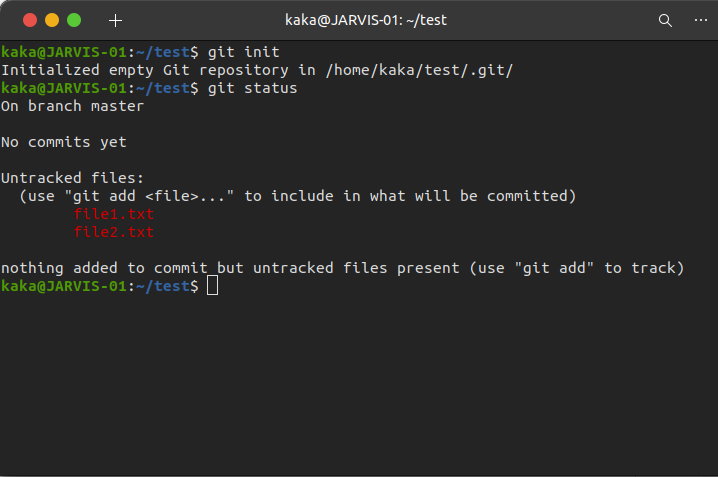
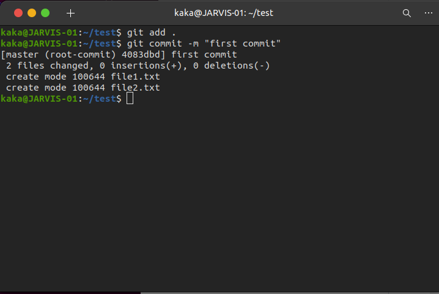
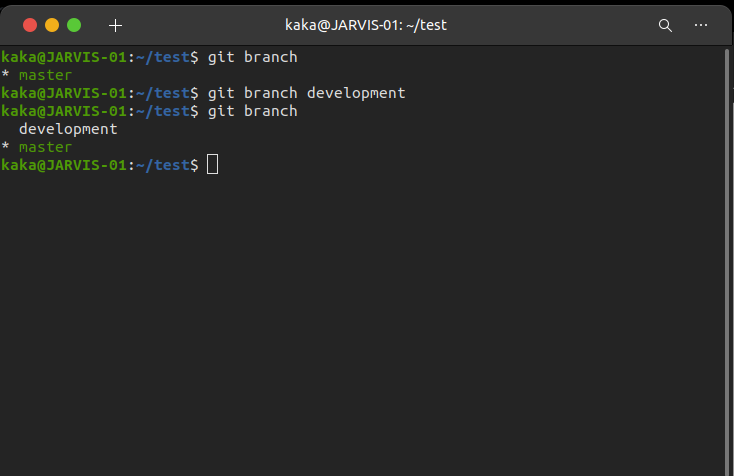

# Git and SSH Keygen
Git adalah sebuah version control management. version control memungkinkan kita untuk memperbaharui suatu dokumen, tetapi jika ada kesalahan atau error kita bsia kembali ke versi sebelumnya.

## Fork Repository App Backend
 * Pertama login kedalam akun github kita
 * Kemudian buka repository backend yang akan difork `https://github.com/sgnd/dumbflix-backend`
 * lalu setelah berada didalam repository backend pilih fork pada kakan atas sebelah watch 

    

 * Setelah itu kita bisa cek didaftar repositori kita bahwa repository App Backend tadi sudah terfork dan berada direpository kita

     

## SSH Keygen For Git
 * Untuk install Git kita bisa gunakan perintah `sudo apt install git -y`

    

 * Git config adalah perintah untuk pengaturan configurasi git dengan memasukkan username dan email yang terdaftar digithub.

    `git config --global user.name "nama github"`

    `git config --global user.email "email github"`

    

 * Untuk membuat sebuah keygen kita bisa memasukkan perintah `ssh-keygen`

    

 * Jika sudah kita bisa cek di direk tori /.ssh `cd ~/.ssh`kemudian `ls`

    

 * Kemudian buka isi dari file id_rsa.pub `cat id_rsa.pub`
 * Jika sudah copy isinya
 * Setelah itu buka menu setting di github kita
 * Kemudian pilih ssh and gpg keys
 * Lalu add ssh key dan masukkan ssh key kedalam key dan beri nama

    

 * Terakhir cek apakah ssh sudah berhasil terhubung dengan github `ssh -T git@github.com`

    

## Perintah dasar git

 * Git clone dari repository github `https://github.com/sgnd/dumbflix-backend.git`

    `git clone https://github.com/sgnd/dumbflix-backend.git`

    

 * Git init adalah perintah untuk menginisialisasi sebuah repositori lokal

    `git init`

    

 * Git status adalah perintah untuk mengecek status 

    `git status`

    

 * Git add adalah perintah untuk menandai file yang akan dipush kerepositori

    `git add nama file`

    

 * Git reset adalah perintah untuk membatalkan penandaan file

    `git reset nama file`

    

 * Git commit adalah perintah untuk melakukan commit pada perubahan ke head

    `git commit -m "first commit"`

    

 * Git remote adalah perintah untuk menghubungkan user dengan remote repository.
  - Sebelumnya kita buat sebuah repository di github kita

    `git remote add nama-remote git@github.com:Bimosatria-code/example.git`

    

    

 * Git push adalah perintah untuk mengupload data dari repository lokal ke repository github.

    `git push nama-remote nama-branch`

    

  - jika sudah bisa kita lihat direpository git kita dan refresh

    

 * Git branch adalah perintah untuk membuat percabangan.

    `git branch`

    `git branch nama-yang diinginkan`

    

 * Git checkout adalah perintah untuk berpindah branch

    `git checkout nama-branch`

      

 * Git pull adalah perintah untuk mengupdate perubahan yang terjadi di website git

    `git pull nama-remote nama-branch`

    

 * Git merge adalah perintah untuk menyatukan dan menggabungkan percabangan.

    `git merge branch-aktif branch-tujuan`

    

