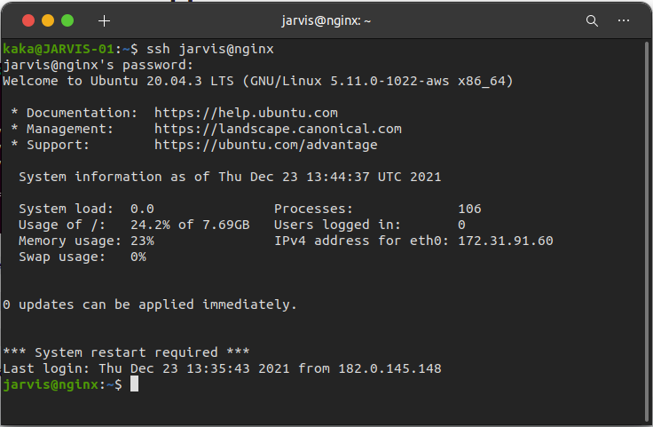

# Reverse Proxy App Backend
    Pada Pembahasan ini kita akan membahas langkah- langkah reverse proxy dengan server dari AWS kita untuk app backend, berikut langkah-langkahnya:

 * pertama tama masuk keserver kita `ssh jarvis@AppBackend`

    

 * Kemudian kita masuk kedalam direktori /etc/nginx `cd /etc/nginx`
 * Lalu kita masuk kedalam direktori dumbflix `cd dumbflix`
 * Lalu buat file didalam direktori dumbflix dengan perintah `sudo nano api.bimo.onlinecamp.id`
 * Didalamnya kita bisa isikan seperti gambar dibawah

    

 * Setelah selesai kita bisa klik `ctrl + x` lalu tekan `y` dan `enter`
 * Kemudian mundur satu direktori
 * Lalu kita edit file nginx.conf `sudo nano nginx.conf` ini berguna untuk memberi akses lokasi kepada direktori dan file yang barusan kita buat

    
 
 * Setelah selesai kita bisa klik `ctrl + x` lalu tekan `y` dan `enter`
 * kemudian kita cek apakah ada kesalahan atau tidak dalam set confignya dengan `sudo nginx -t`

    

 * Lalu reload nginx `sudo systemctl reload nginx`
 * Kemudian arahkan domain dengan ip publik server backend yg dipakai untuk reverse proxy `44.198.253.15`

    

* Jika sudah kita bisa akses dibrowser dengan `http://api.bimo.onlinecamp.id`/

    