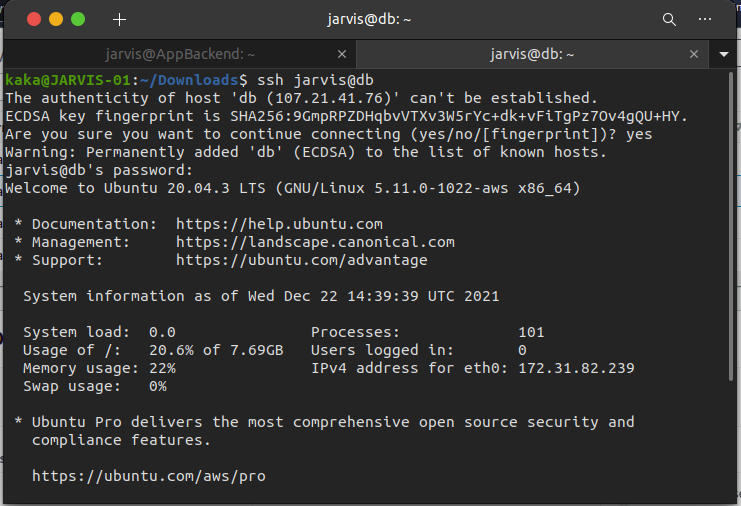

# Setup Database
    Pada Pembahasan ini kita akan membahas bagaimana cara setup server database, berikut langkah-langkahnya:
  
## Create New Instance
 * pertama tama buka AWS Educate dan login.
 * Launch new instance
 * buat instance dengan spec:
    - ubuntu 20.04 LTS
    - t2 micro
    - 8 Gb
    - Security group all traffic
    - Private Ip

    

## Install Database

 * Pertama kita masuk server database kita dengan perintah `ssh jarvis@db`

    

 * Kemudian Kita update `sudo apt update` dan upgrade `sudo apt upgrade -y`
 * Lalu install mysql `sudo apt install mysql*`

    

 * Jika sudah terinstall cek dengan `sudo systemctl status mysql.service`

    

 * Kemudian konfigurasi keamanan database `sudo mysql_secure_installation`
 * Didalam konfigurasi kita bisa pilih untuk menggunakan password dan kemudian set passwordnya

    

## Create User

 * Pertama kita masuk ke dalam mysql `sudo mysql -u root -p`

    

 * setelah itu `CREATE USER 'bimo@'%' IDENTIFIED BY 'bibimsatria1';`

    

 * setelah itu `create database dumbflix;`

    

 * Kemudian kita bisa cek dengan  `show databases;`
 * Jika sudah Ketikkan command berikut untuk menset agar user bimo dapat connect/ diakses oleh segala port `GRANT ALL PRIVILEGES ON dumbflix.* TO 'bimo'@'%';`
 * Jika sudah ketik `FLUSH PRIVILEGES` untuk merestart

    

 * Jika sudah kita logout dr mysql dan masuk lagi dengan perintah `mysql -u bimo -p`

    

# Set agar database dapat connect ke Backend

 * Buka folder `/etc/mysql/mysql.conf.d` kemudian edit file `mysqld.cnf`
 * Lalu ubah ip pada bind-address dan mysqlx-bind-address menjadi 0.0.0.0 agar bisa diakses dr semua port

    

 * Jika sudah kita kembali keserver backend dan masuk `cd ~/dumbflix-backend/config` lalu edit `sudo nano config.json` 
 * Ubah pada bagian development
    - username: masukkan username kita di mysql
    - password: masukkan password kita dimysql
    - database: masukkan nama database yg sudah kita buat
    - host: masukkan ip private server database kita

    

 * install sequelize `npm install --save-dev sequelize-cli -g`
 * Lalu kita bisa migrasi ke database dengan menggunakan perintah `sequelize db:migrate` dan tunggu hingga prosesnya selesai

    

 * Setelah itu jika proses migrasi sudah selesai kita bisa cek di server database kita 
 * masuk ke server database dan masuk mysql `mysql -u bimo -p`
 * Lalu `show databases;`
 * lalu `use dumbflix`
 * Terakhir `show tables;`

    
