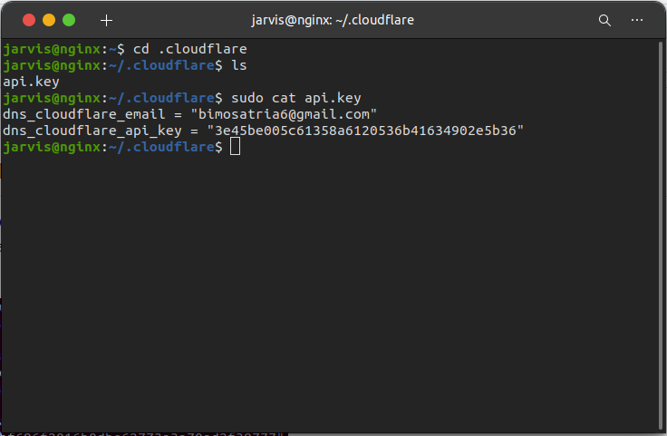

# SSL Configuration App Backend

 * Kita akan memakai api yg minggu lalu
 * Kemudian masuk ke server aws yg menjadi gateway

     

 * Setelah itu masuk kedalam direktorinya `cd .cloudflare/`
 * Setelah kita bisa cek file api.key `sudo cat api.key`

     

 * Karena kita sudah menginstall certbot kita bisa langsung saja jalankan certbot `sudo certbot`
 * Dan kita pilih saja nomer `2. api.bimo.onlinecamp.id`

     

 * Jika prosesnya sudah selesai kita cek sertifikasinya dengan masuk ke `cd /etc/nginx/dumbflix`
 * Lalu kita bisa melihatnya dengan `cat api.bimo.onlinecamp.id` atau `sudo nano api.bimo.onlinecamp.id`

     
 
 * Setelah itu kita masukkan perintah `sudo nginx -t` untuk mengecek apakah konfigurasinya berhasil atau ada kesalahan

     

 * Terakhir kita bisa akses dibrowser dengan `https://bimo.onlinecamp.id`

     