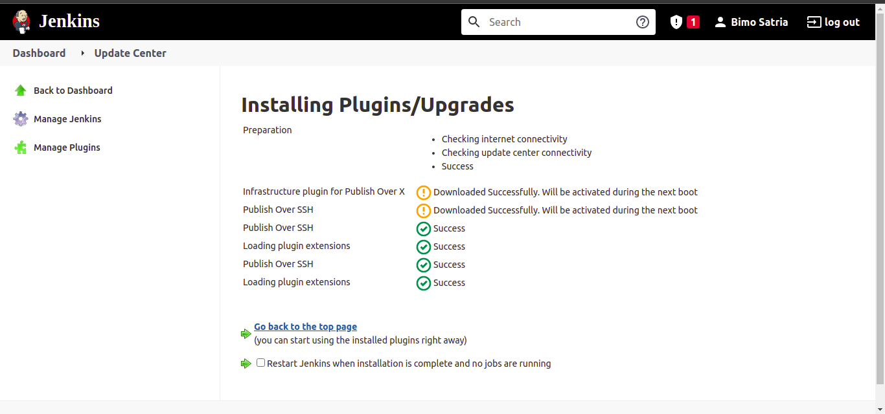
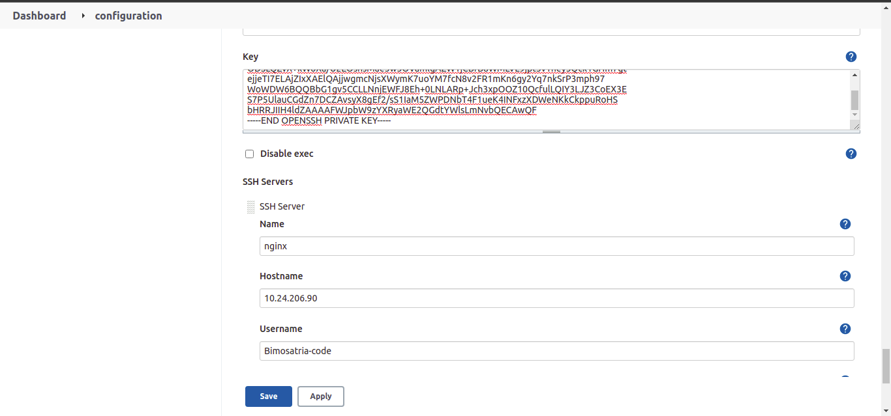
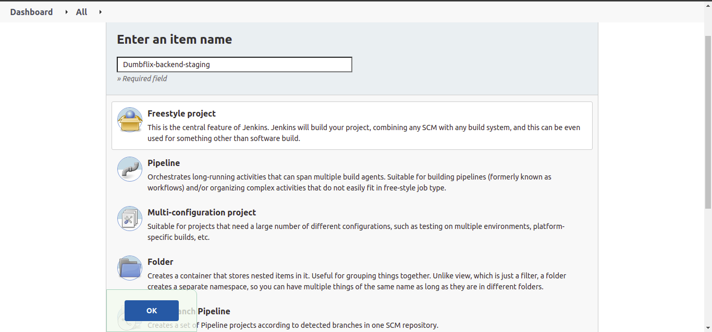
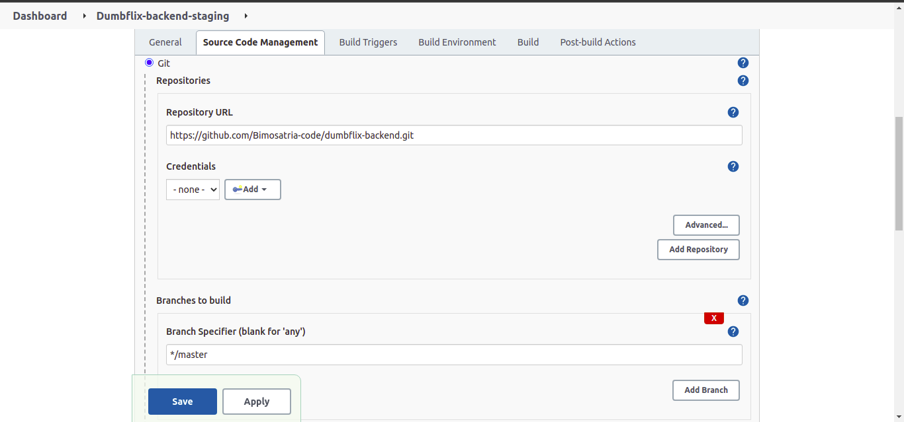
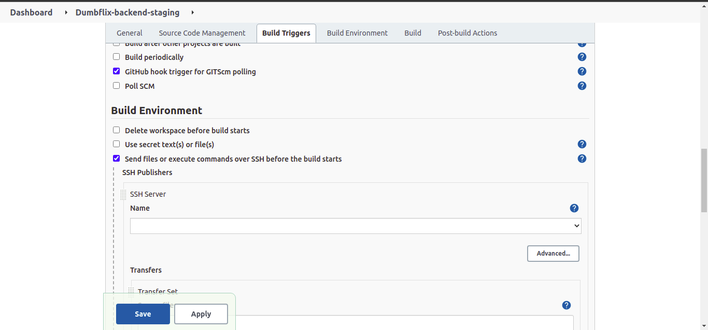
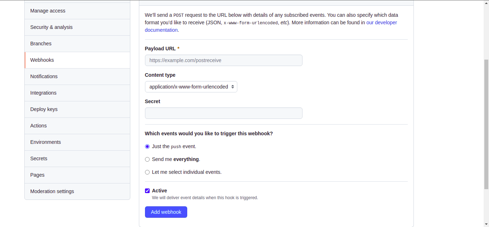

# Setup Jenkins
    Pada Pembahasan ini kita akan membahas langkah-langkah mensetup jenkins, berikut langkah-langkahnya:

## Requirements

 * Install plugin Publish Over SSH
 * Multipass Instance
 * ssh key
 * System configuration

 ## Configure System in Jenkins

 * install plugin `Publish Over SSH`

    

 * Pada hamalan dashboard masuk ke manage jenkins
 * kemudian pilih configuration system
 * cari publish over ssh
 * copy paste key ssh yg dibuat diserver
 * masukkan nama server yg kita inginkan
 * masukkan hostname server dengan ip server kita
 * input username

    

 * test koneksi SSH keserver

## Create Job
 * Pertama-tama masuk ke server jenkins
 * Klik Create Job
 * Masukkan nama project kemudian pilih freestyle project

    

 * Isikan pada bagian source code management pilih Git
 * masukkan repository dan branch yang digunakan

    

 * Pada build trigger pilih ` Github hook trigger for GITScm polling`

    

 * Kemudian pada build pilih `send files or execute commands over ssh`
 * kemudian masukkan name
 * Setelah itu ceklis `verbose output in console` untuk bisa melihat log buildnya
 * Pada bagian transfer set isi source file, remote directory dan exec command
 * Setelah itu set Execution time jadi 0
 * Kemudian Apply and save
 * Build manual dengan build now

## Create Job
 * Login ke akun Github
 * masuk ke halaman repository kita kemudian pilih setting
 * Kemudian Pilih webhook
 * Pilih add webhook
 * Masukkan hostname server jenkins di playload URL

    

 * Pilih just the push event
 * Setelah itu add webhook 