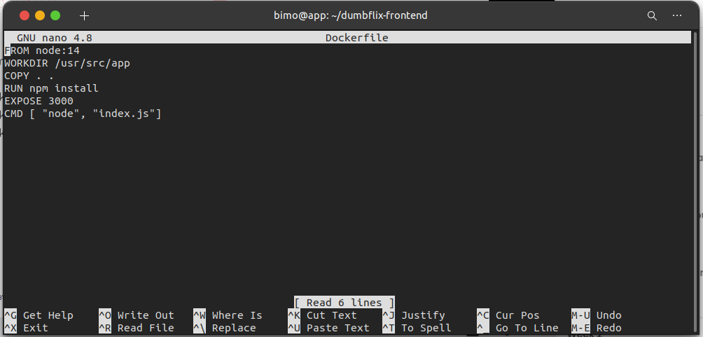
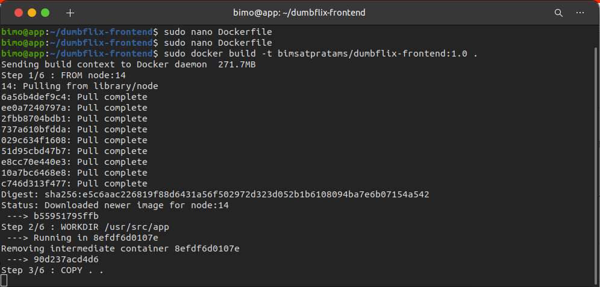
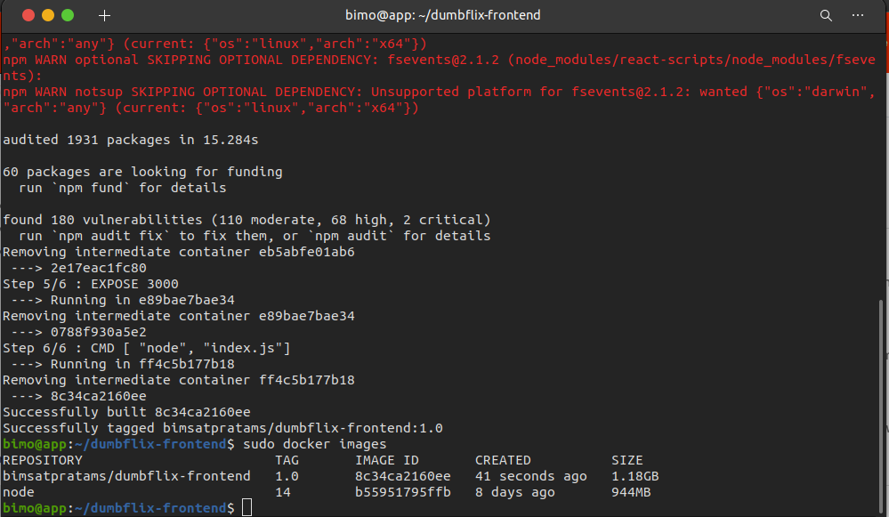
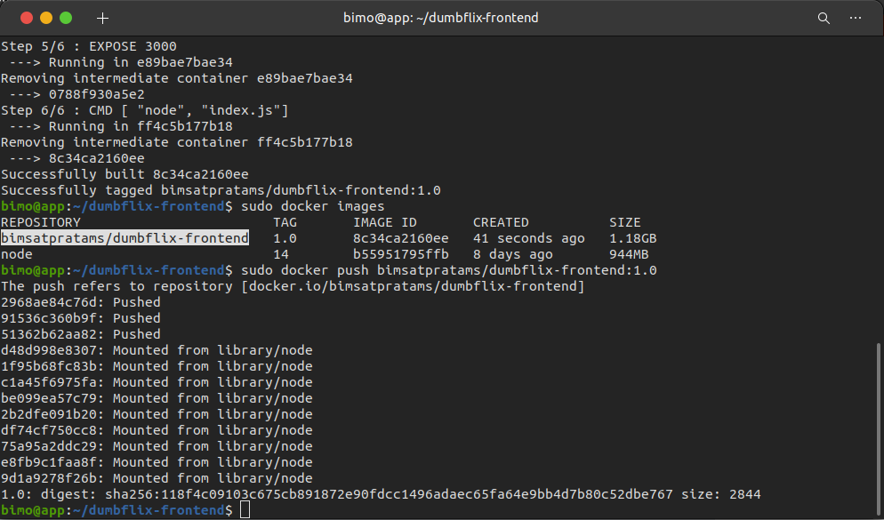
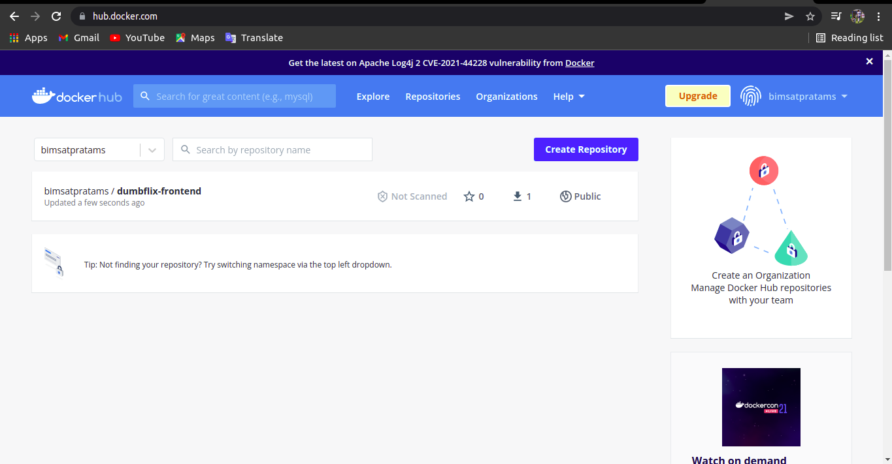
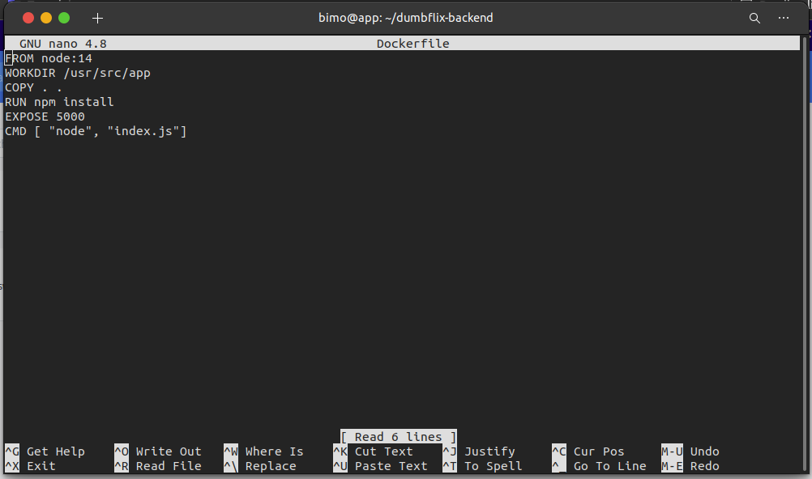
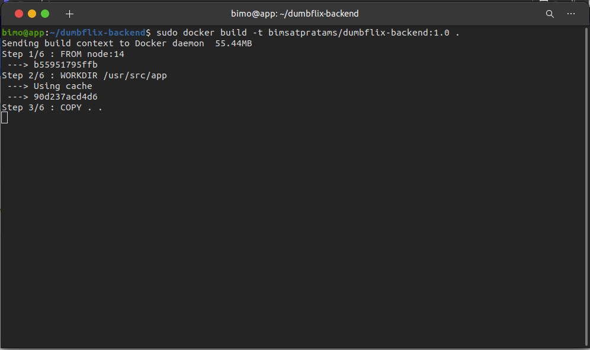
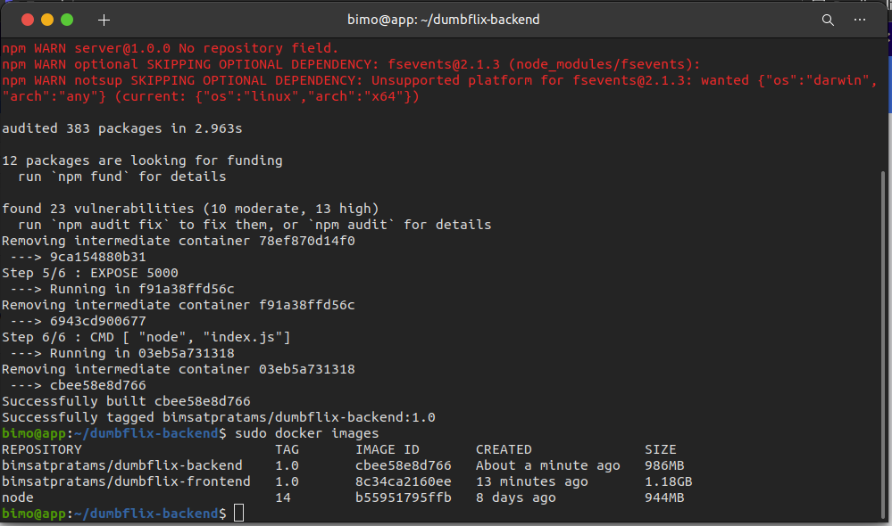
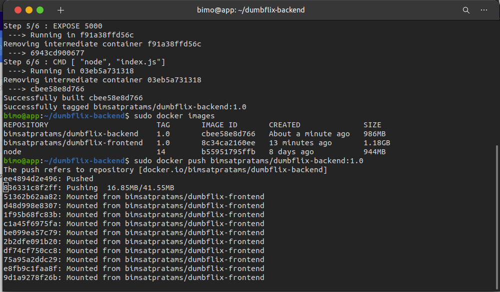
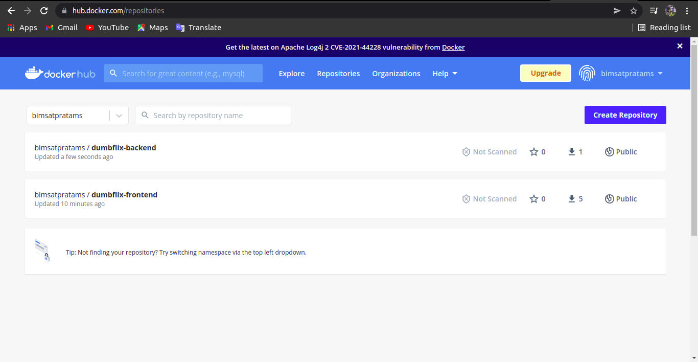

# Create Docker Image
    Pada Pembahasan ini kita akan membahas Pembuatan docker image untuk App Frontend dan App backend, berikut langkah-langkahnya:

# Create Docker Image App Frontend

 * Pertama-tama kita masuk keserver Tempat App Frontend 
 * Lalu didalam direktori dumbflix-frontend saya buat Dockerfile `sudo nano Dockerfile`
 * Lalu masukkan konfigurasi perintah untuk membuat image

    

 * Kemudian langkah selanjutnya build imagenya `sudo docker build -t bimsatpratams/dumbflix-frontend:1.0 .`

     

 * Setelah itu tunggu proses build selesai
 * Jika sudah selesai kita cek hasil build images dengan perintah `sudo docker images`

     

 * Setelah itu kita push images yang sudah dibuat ke repository docker.hub kita `sudo docker push bimsatpratams/dumbflix-frontend:1.0`

     

 * Kemudian tunggu sampai proses selesai dan jika sudah kita bisa cek di akun docker.hub kita

     

# Create Docker Image App Backend

 * Pertama-tama kita masuk keserver Tempat App Backend
 * Lalu didalam direktori dumbflix-backend saya buat Dockerfile `sudo nano Dockerfile`
 * Lalu masukkan konfigurasi perintah untuk membuat image

    

 * Kemudian langkah selanjutnya build imagenya `sudo docker build -t bimsatpratams/dumbflix-backend:1.0 .`

     

 * Setelah itu tunggu proses build selesai
 * Jika sudah selesai kita cek hasil build images dengan perintah `sudo docker images`

     

 * Setelah itu kita push images yang sudah dibuat ke repository docker.hub kita `sudo docker push bimsatpratams/dumbflix-backend:1.0`

     

 * Kemudian tunggu sampai proses selesai dan jika sudah kita bisa cek di akun docker.hub kita

     
