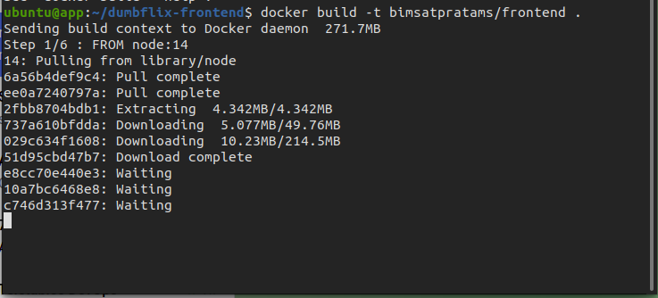
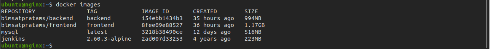
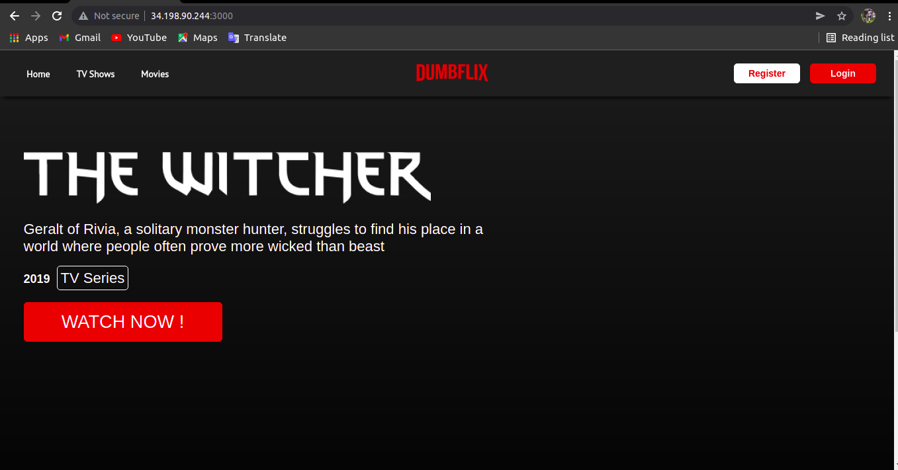
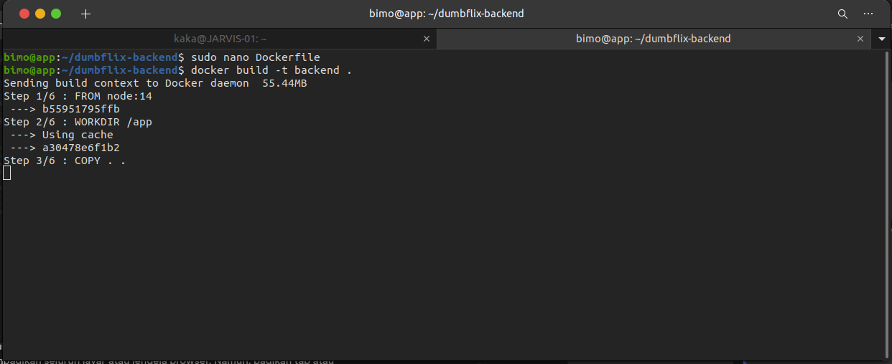
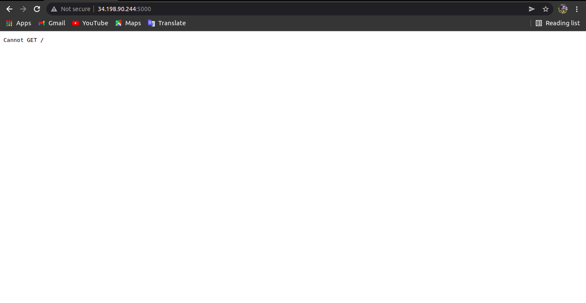
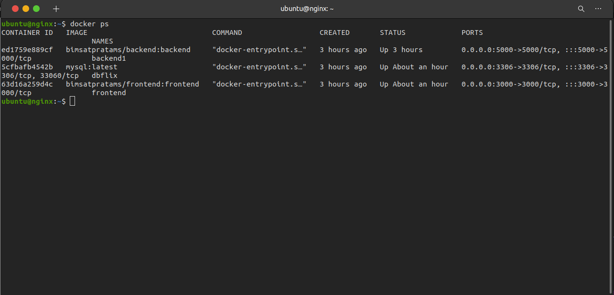
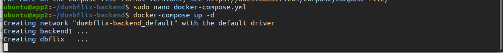

# Deploy App with Docker
    Pada Pembahasan ini kita akan membahas Pembuatan docker image untuk App Frontend dan App backend, berikut langkah-langkahnya:

# Install Frontend

 * Pertama-tama kita masuk keserver Tempat App Frontend 
 * Lalu didalam direktori dumbflix-frontend saya buat Dockerfile `sudo nano Dockerfile`

    FROM node:14-alpine

    WORKDIR /app

    COPY . .

    RUN npm install

    EXPOSE 3000

    CMD [ "npm", "start" ]

 * Lalu masukkan konfigurasi perintah untuk membuat image untuk app frontend

    `docker build -t bimsatpratams/frontend .`

    

 *  Cek images dengan `docker images`

     

 * Jika images sudah berhasil terbuat kita jalankan dan buat container 
 
    `docker run -itd -p 3000:3000 --name frontend bimsatpratams/frontend:frontend`

 * Jika sudah kita bisa cek container sudah berjalan atau belum

    `docker ps`

 * Jika sudah berjalan maka akses dengan ip dan port aplikasinya

    

# Install Backend

 * Pertama-tama kita masuk keserver Tempat App Backend
 * Lalu didalam direktori dumbflix-backend saya buat Dockerfile `sudo nano Dockerfile`

    FROM node:14-alpine

    WORKDIR /app

    COPY . .

    RUN npm install

    EXPOSE 5000

    CMD [ "npm", "start" ]

 * Lalu masukkan konfigurasi perintah untuk membuat image untuk app frontend

    `docker build -t bimsatpratams/backend .`

    

 *  Cek images dengan `docker images`

     

 * Jika images sudah berhasil terbuat kita jalankan dan buat container 
 
    `docker run -itd -p 3000:3000 --name backend bimsatpratams/backend:backend`

 * Jika sudah kita bisa cek container sudah berjalan atau belum

    `docker ps`

 * Jika sudah berjalan maka akses dengan ip dan port aplikasinya

    

# Install With Docker Compose

 * Pertama siapkan file `docker-compose.yml`

    version: '3.7'

services:

    backend:

      image: bimsatpratams/backend:backend

      container_name: backend1

      ports:

        - 5000:5000

    database:

      image: mysql:latest

      container_name: dbflix

      restart: always

      environment:

        - MYSQL_ROOT_PASSWORD=123456

        - MYSQL_DATABASE=dumbflix

      ports:

        - 3306:3306

      volumes:
      
        - /home/ubuntu/db-data/dbflix:/var/lib/mysql

 * Setelah itu `docker-compose up -d` untuk membuat images dan otomatis membuat juga menjalankan container aplikasi
 * jika sudah selesai prosessnya kita bisa cek di `docker ps` maka bisa dilihat statusnya up jika sudah jalan

     

 * Terakhir akses dibrowser `10.24.206.90:3000` dan `10.24.206.90:5000`

     

     