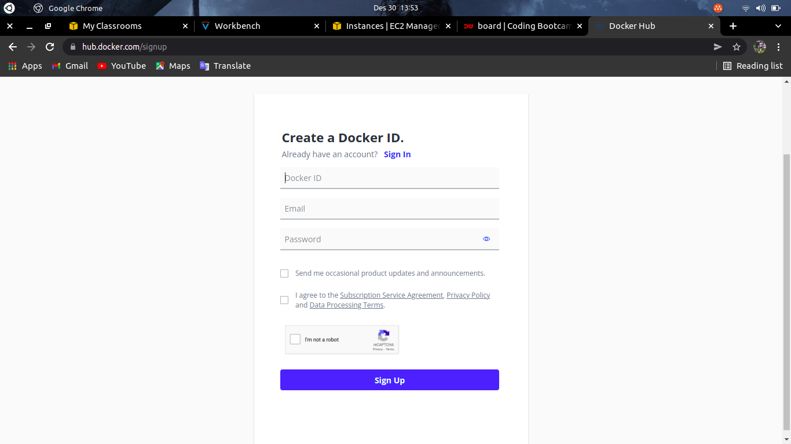

# Install Docker
    Pada Pembahasan ini kita akan membahas langkah-langkah Menginstall Docker, berikut langkah-langkahnya:

 * Pertama-tama kita masuk keserver Tempat App Frontend dan App Backend berada 
 * Lalu install snap `sudo apt install snap`
 * Kemudian install docker `sudo snap install docker`

    

 * Kemudian kita buat akun di docker.hub.com
 * Klik sign up
 * Lalu isi form berisikan docker id, email, dan password setelah itu dibawah ceklis saja dua2nya. Kemudian Signup

    

 * Setelah berhasil membuat akun di docker.hub.com kita kembali ke terminal
 * Lalu kita login dengan menggunakan perintah `sudo docker login`
 * kemudian masukkan username dan password akun docker.hub yang sudah dibuat tadi

    

    

 * Kemudian kita bisa cek versi dari docker dengan menggunakan perintah `sudo docker --version`

    