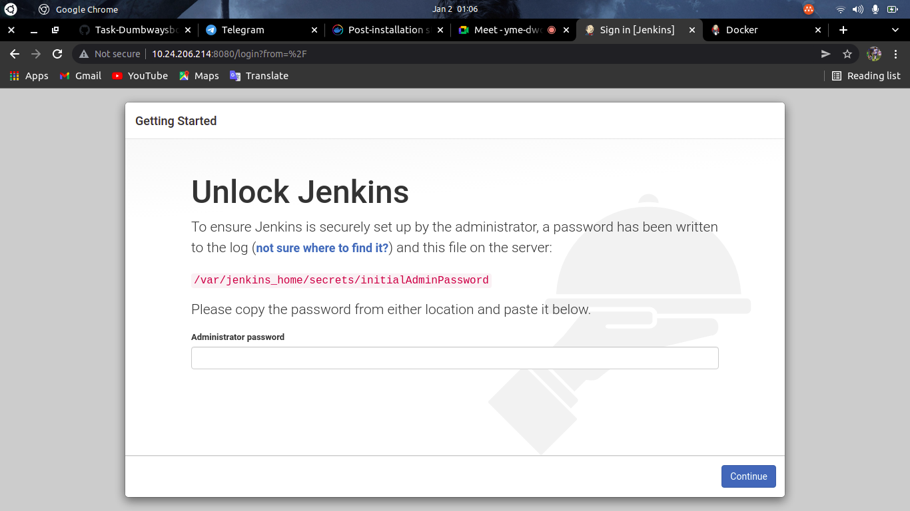
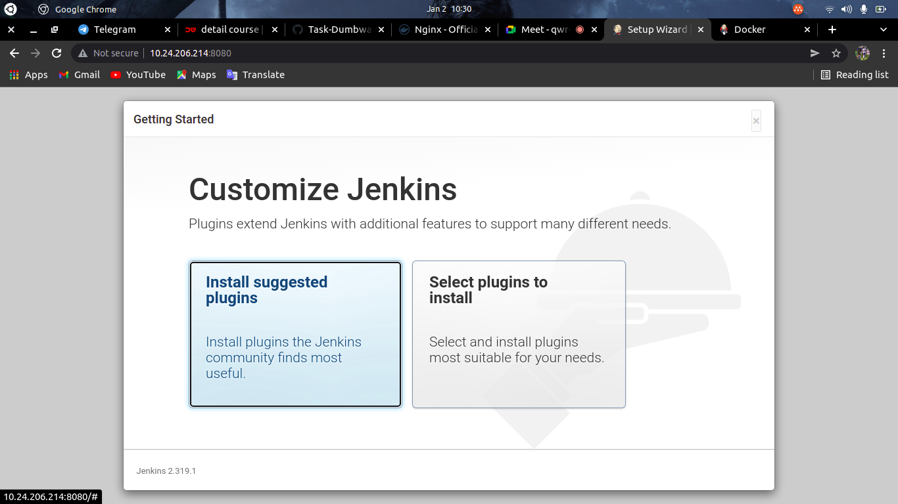
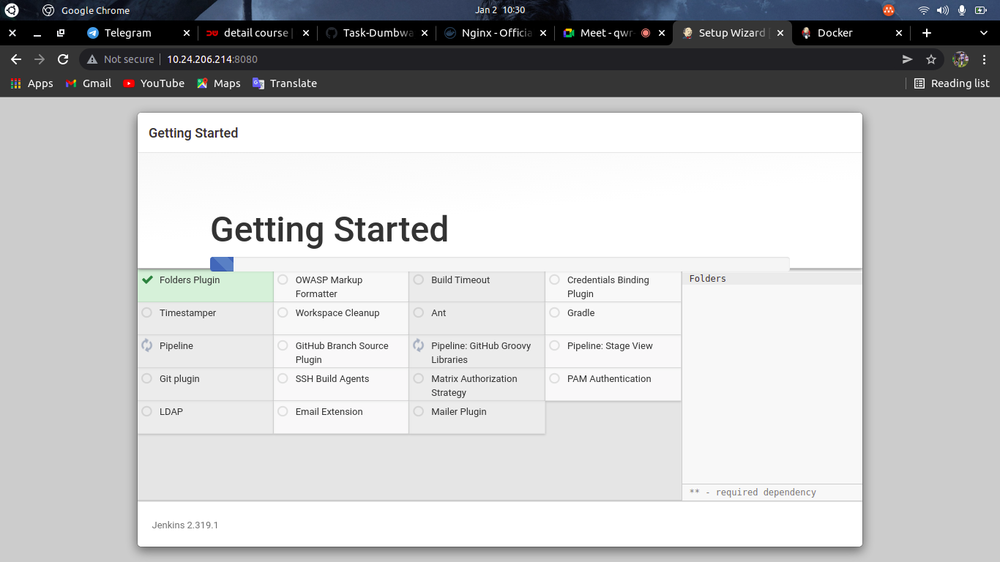
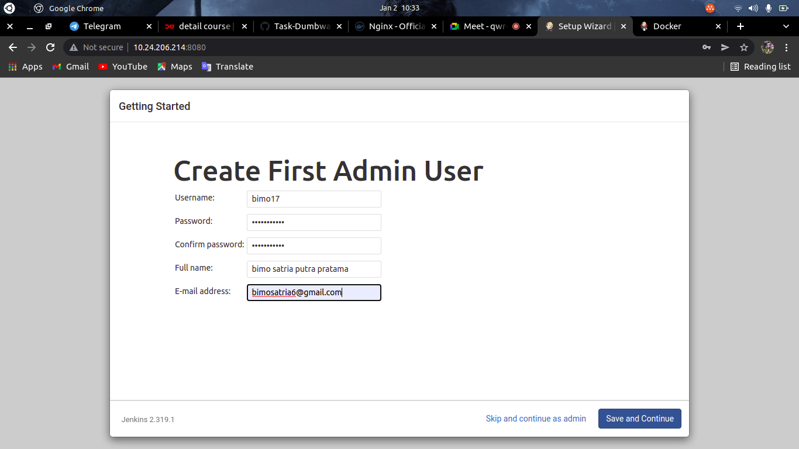
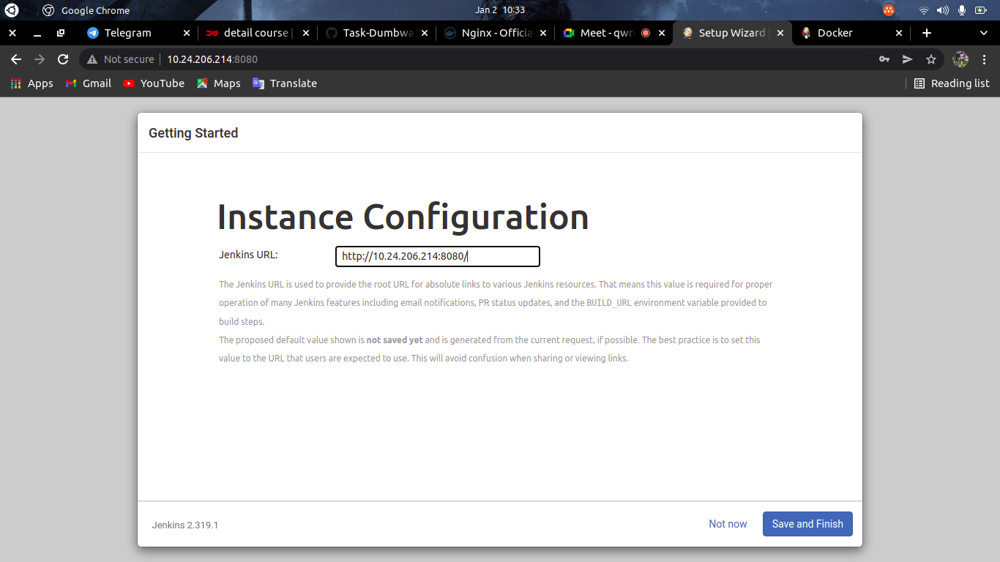
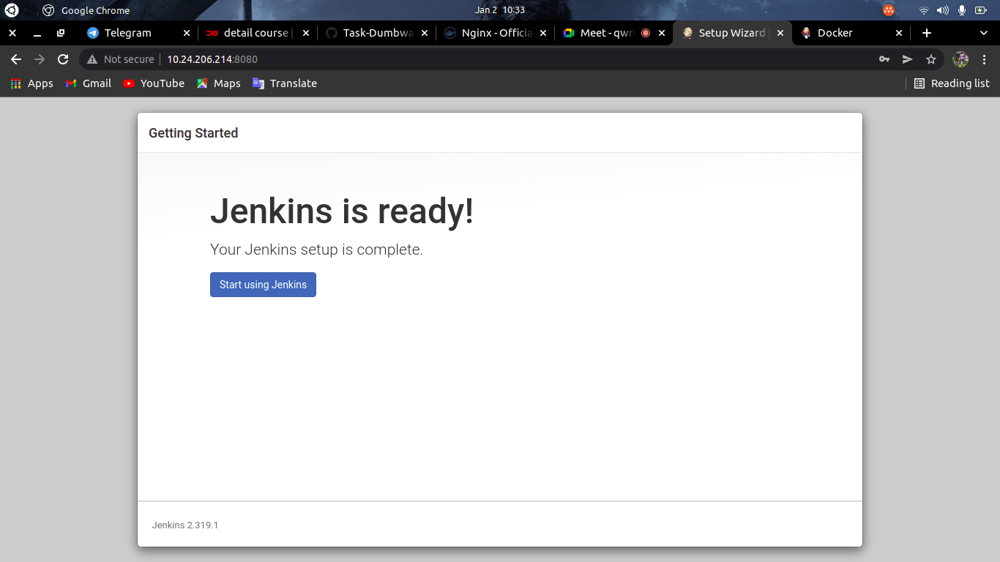
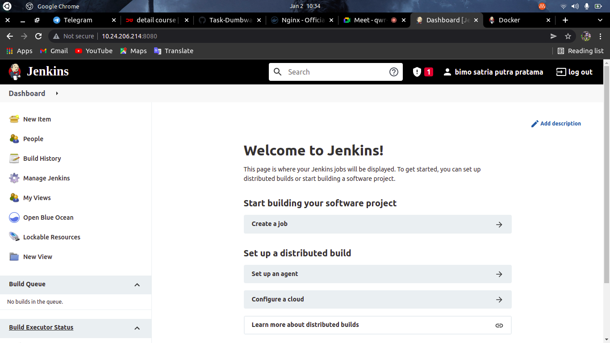

# Install Jenkins
    Pada Pembahasan ini kita akan membahas Install jenkins di docker, berikut langkah-langkahnya:

# Install Jenkins in Docker
 * Pertama-tama kita masuk keserver multipass 
 * Kemudian install jenkins dengan menggunakan perintah pull `docker pull jenkins:2.60.3-alpine`
 * setelah itu jalankan jenkins dengan perintah `docker run --name myjenkins -p 8080:8080 -p 50000:50000 -v var/jenkins_home jenkins:2.60.3-alpine`
 * jika sudah selesai cek dengan perintah `docker ps`
 * jika status sudah up kita buka browser
 * Kemudian masukkan ip server dengan port 8080 `10.24.206.90:8080`
 * selanjutnya kita ambil password administrator di `/var/jenkins_home/secrets/initialAdminPassword`
 * Lalu masukkan di administrator password

    

 * Selanjutnya pilih install suggested plugins

     

 * Kemudian proses install plugin akan berjalan

     

 * Buat first admin user

     

 * instance configuration akan berisi url kita

     

 * pilih starting using

     

 * pilih starting using

     
