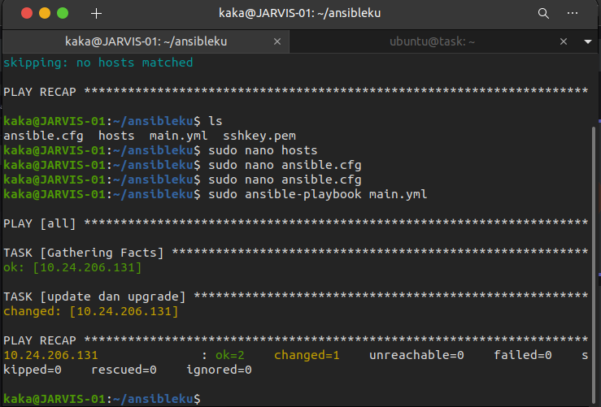
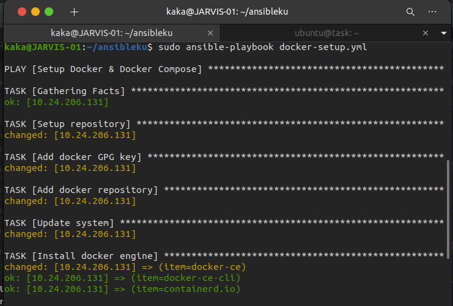
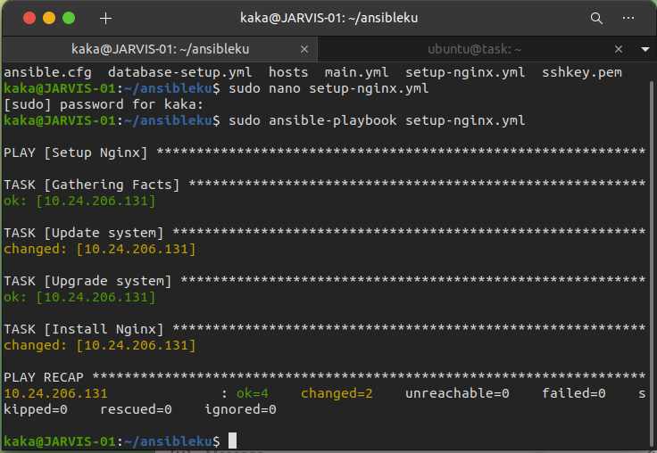

# Ansible setup
    Pada Pembahasan ini kita akan membahas langkah-langkah untuk Setup ansible, berikut langkah-langkahnya:

## Install Ansible
 ```
sudo apt update
sudo apt install software-properties-common
sudo add-apt-repository --yes --update ppa:ansible/ansible
sudo apt install ansible
```

 ## Membuat Inventory

 * Buat direktori untuk menyimpan file config
 * Masuk kedalam folder dan buat file inventori untuk ansible yang bernama hosts fungsinya untuk menyimpan hostserver

 ```
 [server app]
<Ip server tujuan 1> ansible_user=ubuntu
<Ip server tujuan 2> ansible_user=ubuntu
```

 * Kemudian buat file yang berisi sshkey guna masuk kedalam server. disini akan bernama ssh-key dan ubah kepemilikan berkas sudo chmod 400 sshkey.pem
  
 * Ping hosts untuk memastikan koneksi ansible dengan server host berjalan dengan perintah

    `sudo ansible all --key-file sshkey.pem -i hosts -m ping`

 

## Setup ansible

 * Buat file bernama ansible.cfg `sudo nano ansible.cfg`
 * Masukkan config berikut

    ```
    [defaults]
    inventory = hosts # nama file inventori untuk menyimpan serverhost 
    private_key_file = sshkey.pem #ssh-key guna akses server
    ```
 * Kemudian test
    
    `sudo ansible all --key-file sshkey.pem -i hosts -m ping`

## Ansible-playbook

1. main.yml 
 * Buat file main.yml untuk update dan upgrade sistem `sudo nano main.yml` isi dari file
    ```
    - hosts: all
      become: true
      tasks:
      - name: update dan upgrade
        apt:
          update_cache: yes
          upgrade: dist
    ```
  * Kemudian jalankan perintah `Jalankan dengan perintah sudo ansible-playbook main.yml`

  

2. docker-setup.yml
 * Buat file yml docker-setup.yml
 * Berikutnya isikan config berikut kedalam file
  ```
  - name: Setup Docker & Docker Compose
  hosts: 10.24.206.6
  become: true
  tasks:
    - name: Setup repository
      shell: "sudo apt-get install ca-certificates curl gnupg lsb-release"
      args:
        executable: /bin/bash

    - name: Add docker GPG key
      apt_key:
        url: https://download.docker.com/linux/ubuntu/gpg
        state: present

    - name: Add docker repository
      apt_repository:
        repo: deb https://download.docker.com/linux/ubuntu focal stable
        state: present

    - name: Update system
      apt:
        update_cache: yes

    - name: Install docker engine
      apt:
        name: "{{item}}"
        state: latest
        update_cache: yes
      loop:
        - docker-ce
        - docker-ce-cli
        - containerd.io

    - name: Install stable release docker compose
      shell: sudo curl -L "https://github.com/docker/compose/releases/download/1.29.2/docker-compose-$(uname -s)-$(uname -m)" -o /usr/local/bin/docker-compose
      args:
        executable: /bin/bash

    - name: Apply executable permission to the binary
      shell: "sudo chmod +x /usr/local/bin/docker-compose"
      args:
        executable: /bin/bash
  ```
 * Kemudian jalankan perintah `sudo ansible-playbook docker-setup.yml`

  

3. setup-nginx.yml
 * Buat file yml setup-nginx.yml
 * Berikut isi dari filenya
    ```
- name: Setup Nginx
  hosts: 34.192.151.138
  become: true
  tasks:
    - name: Update system
      apt:
        update_cache: yes
    - name: Upgrade system
      apt:
        upgrade: dist

    - name: Install Nginx
      apt:
        name: nginx
        state: present
        update_cache: yes
    ```
 * Kemudian jalankan perintah `sudo ansible-playbook setup-nginx.yml` 

  

4. jenkins-setup.yml
 * Buat file yml jenkins-setup.yml
 * dan buat sebuah folder `docker-jenkins` yang berisikan file docker-compose.yml
 * Berikut isi dari filenya
 ```
 - name: Setup CI/CD Jenkins Docker
  hosts: all
  become: true
  tasks:
    - name: Copy docker compose
      copy:
        src: docker-jenkins/docker-compose.yml 
        dest: /home/ubuntu/

    - name: Run docker compose
      shell: "docker-compose up -d"
      args:
        executable: /bin/bash
 ```
 * Kemudian jalankan perintah `sudo ansible-playbook jenkins-setup.yml`