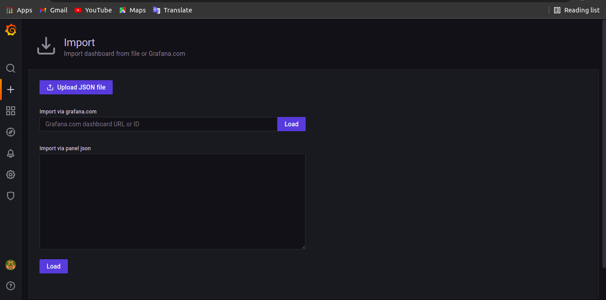

# Connect Multiple Server
    Pada Pembahasan ini kita akan membahas langkah-langkah untuk connect multiple server, berikut langkah-langkahnya:

 ## Menghubungkan server monitoring dengan server lain yang akan dimonitoring

 * Install node_exporter diserver yang akan dimonitoring
 * Jika sudah terinstall tambahkan alamat server kedalam file prometheus.yml

   `sudo nano /etc/prometheus/prometheus.yml`

 * kemudian restart aplikasi prometheus dan buka web browser, pilih targets dan dapat dilihat apakah sudah terkoneksi atau belum

## Melihat data yang dimonitoring dari dashboard grafana

 * Masuk kedalam grafana
 * pilih konfigurasi
 * Kemudian pilih data source
 * Lalu pilih Prometheus
 * Isikan Ip dan port dari Prometheus `<Ip server:9090>
 * Jika sudah bisa pilih save dan test
 * Jika sudah berhasil terkonfigurasi akan menampilkan pesan data source is working 

    

## Menampilkan Informasi dari server

 * Cari tanda + lalu pilih import
 * Kemudian cari dashboard di https://grafana.com/grafana/dashboards/
 * setelah mendapatkan yang sesuai copy id lalu masukkan pada bagian import
 * Klik load dan import

   

 * Jika sudah kita dapat melihat tampilan dashboard, disana akan muncul tampilan informasi seperti CPU, RAM, Network traffic dan Memory

   

 