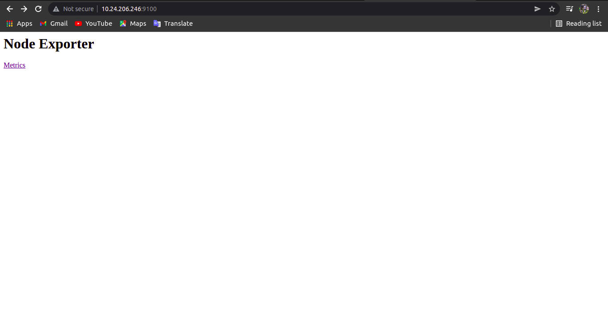
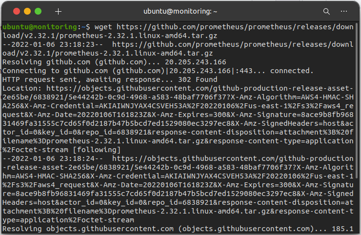
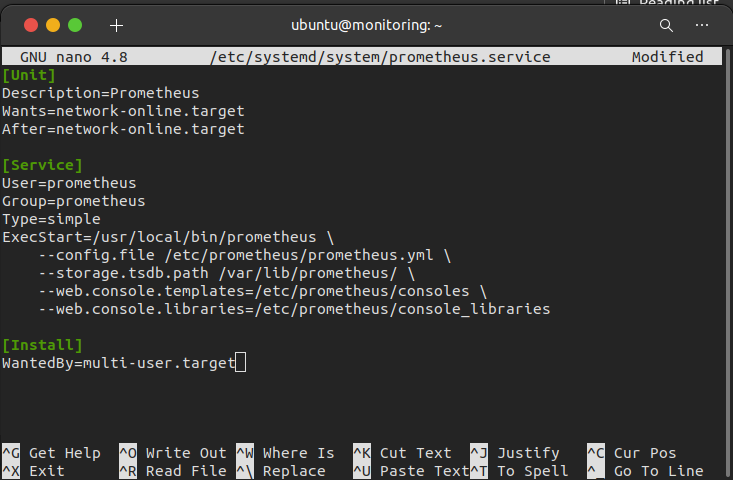
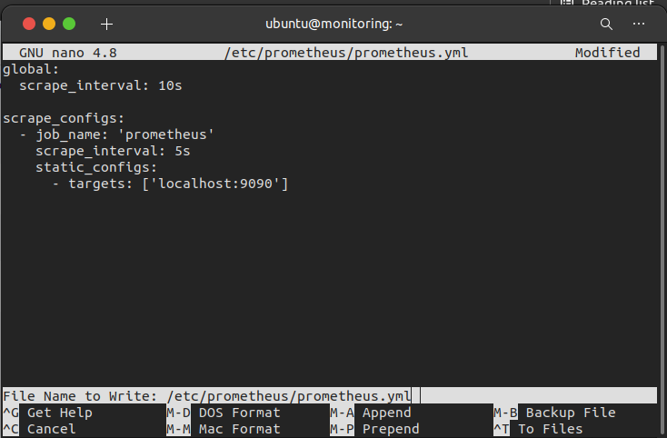
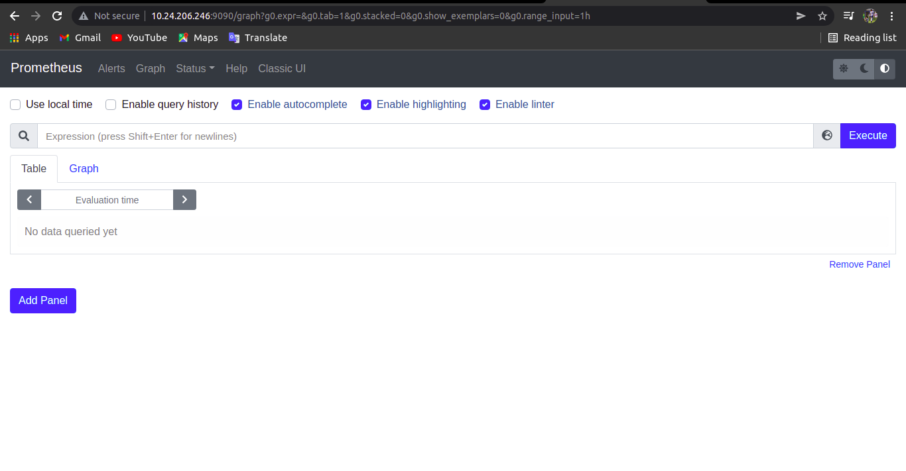
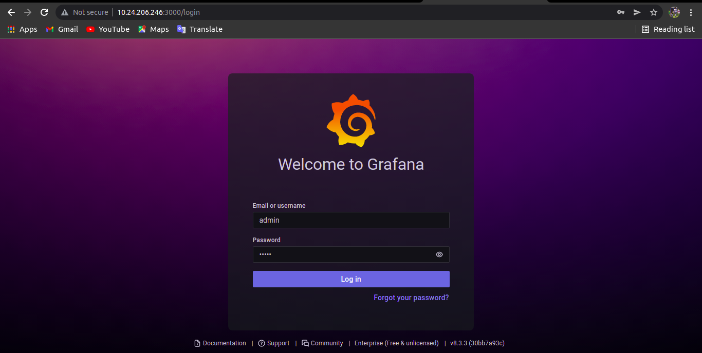
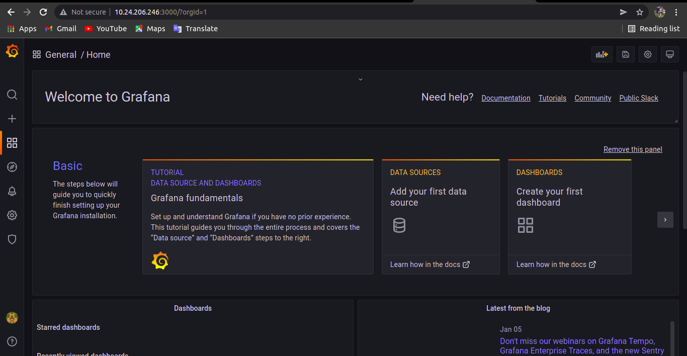

# Connect Multiple Server
    Pada Pembahasan ini kita akan membahas langkah-langkah untuk connect multiple server, berikut langkah-langkahnya:

## Aplikasi yang akan diinstall
 * Node Exporter
 * Prometheus
 * Grafana

 ## Installasi Node Exporter

 * Download terlebih dahuluh node exporternya. untuk versi terbaru dapat dilihat di githubnya node_exporter

  `curl -LO https://github.com/prometheus/node_exporter/releases/download/v1.3.1/node_exporter-1.3.1.linux-amd64.tar.gz`

 * kemudian ekstrak file yang telah didownload

  `tar -xvf node_exporter-1.3.1.linux-amd64.tar.gz`

 * Pindahkan file node exporter kedalam usr/local/bin/

  `sudo mv node_exporter-1.3.1.linux-amd64/node_exporter /usr/local/bin/`

 * Setelah itu add user

  `sudo useradd -rs /bin/false node_exporter`

 * Buat file dalam systemd node exporter

  `sudo nano /etc/systemd/system/node_exporter.service`

   isi filenya

   ```
   [Unit]
  Description=Node Exporter
  After=network.target

  [Service]
  User=node_exporter
  Group=node_exporter
  Type=simple
  ExecStart=/usr/local/bin/node_exporter

  [Install]
  WantedBy=multi-user.target
  ```

 * Kemudian setelah itu reload daemon

  `sudo systemctl daemon-reload`

 * Jalankan node exporter dan buat enable node_exporter

  `sudo systemctl start node_exporter`

  `sudo systemctl enable node_exporter`

 * Cek apakah node_exporter berjalan dengan

  `sudo systemctl status node_exporter

 * Buka browser dan akses http://<alamatIP>:9100


# Melihat data yang dimonitoring dari server

 * Buat file dalam systemd node exporter

   `sudo nano /etc/systemd/system/node_exporter.service`

   ```
   [Unit]
   Description=Node Exporter
   After=network.target

   [Service]
   User=node_exporter
   Group=node_exporter
   Type=simple
   ExecStart=/usr/local/bin/node_exporter

   [Install]
   WantedBy=multi-user.target
   ```

 * Lalu Reload daemon

   `sudo systemctl daemon-reload`

   `sudo systemctl start node_exporter`

   `sudo systemctl enable node_exporter`

 * Buka web browser dan akses `http://(alamat ip):9100`

    


## Install Prometheus

 * Download prometheus dengan menggunakan perintah wget

  `wget https://github.com/prometheus/prometheus/releases/download/v2.32.1/prometheus-2.32.1.linux-amd64.tar.gz`

   

 * kemudian ekstrak prometheusnya yang sudah didownload 

  `tar xvf prometheus-2.32.1.linux-amd64.tar.gz`

 * buat file di etc/

  `sudo mkdir /etc/prometheus`

  `sudo mkdir /var/lib/prometheus`

 * copy file-file ke dalam folder etc/prometheus

  `sudo cp prometheus-2.32.1.linux-amd64/prometheus /usr/local/bin/`

  `sudo cp prometheus-2.32.1.linux-amd64/promtool /usr/local/bin/`

  `sudo cp -r prometheus-2.32.1.linux-amd64/consoles /etc/prometheus`

  `sudo cp -r prometheus-2.32.1.linux-amd64/console_libraries /etc/prometheus`

  * Buat konfigurasi prometheus

  `sudo nano /etc/systemd/system/prometheus.service`

   

  * prometheus.yml

  `sudo nano /etc/prometheus/prometheus.yml`

   

  * Buat user Prometheus

  `sudo useradd -rs /bin/false prometheus`

  * ubah semua konfigurasi agar bisa diakses oleh prometheus

  `sudo chown prometheus:prometheus /etc/prometheus`

  `sudo chown prometheus:prometheus /var/lib/prometheus`

  * Buka web browser dan akses `http://(alamat ip):9090`

  `

## Install Grafana

  * `sudo apt-get install -y apt-transport-https`
  * `sudo apt-get install -y software-properties-common wget`
  * `wget -q -O - https://packages.grafana.com/gpg.key | sudo apt-key add -`
  * `echo "deb https://packages.grafana.com/enterprise/deb stable main" | sudo tee -a /etc/apt/sources.list.d/grafana.list`
  * `sudo apt-get update`
  * `sudo apt-get install grafana-enterprise`
  * `sudo systemctl daemon-reload`
  * `sudo systemctl start grafana-server`
  * `sudo sudo systemctl enable grafana-server.service`
  * `sudo systemctl enable grafana-server.service`

  * Setelah proses instalasi selesai, untuk mengamankan grafana agar tidak setiap orang bisa masuk dapat menggunakan perintah

  `sudo nano /etc/grafana/grafana.ini`

  * kemudian ubah pada blok [user] dan blok [auth_anonymous]

  ```
  [users]
  # disable user signup / registration
  allow_sign_up = false
  [auth.anonymous]
  # disable anonymous access
  enabled = false
  ```
  * jika sudah restart grafana sudo systemctl restart grafana-server
  * akses di web browser, <alamatIP>:3000 akan muncul tampilan pertamakali grafana dan masukkan admin/pass:admin untuk masuk pertama kali

  

  
